# 服务端 TypeScript 迁移详细计划

## 文档信息

- **创建日期**: 2026-03-20
- **项目**: Novel AI Writer
- **目标**: 将服务端代码从 JavaScript 迁移到 TypeScript
- **范围**: src/server/ 目录下所有文件

---

## 一、依赖关系图

### 1.1 模块依赖层次结构

```mermaid
graph TD
    %% 第一层：基础工具层（无依赖）
    subgraph Layer1[第一层：基础工具层]
        CONFIG[config/index.ts]
        HELPERS[utils/helpers.ts]
        VALIDATORS[utils/validators.ts]
        LOGGER[utils/logger.ts]
        CRYPTO[utils/crypto.ts]
        FORMATTERS[utils/formatters.ts]
    end

    %% 第二层：数据库核心层
    subgraph Layer2[第二层：数据库核心层]
        DB_QUERIES[db/queries.ts]
        DB_SCHEMA[db/schema.ts]
        MIDDLEWARE[middleware/errorHandler.ts]
    end

    %% 第三层：数据库初始化和服务层
    subgraph Layer3[第三层：数据库初始化和服务层]
        DB_INDEX[db/index.ts]
        EXPORT_SERVICE[services/exportService.ts]
        LLM_SERVICE[services/llmService.ts]
    end

    %% 第四层：路由层
    subgraph Layer4[第四层：路由层]
        ROUTES_PROJECTS[routes/projects.ts]
        ROUTES_CHATS[routes/chats.ts]
        ROUTES_MESSAGES[routes/messages.ts]
        ROUTES_TIMELINE[routes/timeline.ts]
        ROUTES_CHARACTERS[routes/characters.ts]
        ROUTES_SETTINGS[routes/settings.ts]
        ROUTES_PROMPTS[routes/prompts.ts]
        ROUTES_LLM[routes/llm.ts]
        ROUTES_DATABASE[routes/database.ts]
        ROUTES_EXPORT[routes/export.ts]
    end

    %% 第五层：应用入口层
    subgraph Layer5[第五层：应用入口层]
        INDEX[index.ts]
    end

    %% 依赖关系
    FORMATTERS --> HELPERS
    DB_QUERIES --> CONFIG
    DB_SCHEMA --> HELPERS
    MIDDLEWARE --> LOGGER

    DB_INDEX --> CONFIG
    DB_INDEX --> DB_QUERIES
    DB_INDEX --> DB_SCHEMA
    DB_INDEX --> HELPERS

    EXPORT_SERVICE --> DB_QUERIES
    EXPORT_SERVICE --> HELPERS
    EXPORT_SERVICE --> FORMATTERS

    LLM_SERVICE --> CONFIG

    ROUTES_PROJECTS --> DB_QUERIES
    ROUTES_PROJECTS --> HELPERS
    ROUTES_PROJECTS --> FORMATTERS
    ROUTES_PROJECTS --> MIDDLEWARE

    ROUTES_CHATS --> DB_QUERIES
    ROUTES_CHATS --> HELPERS
    ROUTES_CHATS --> FORMATTERS
    ROUTES_CHATS --> MIDDLEWARE

    ROUTES_MESSAGES --> DB_QUERIES
    ROUTES_MESSAGES --> HELPERS
    ROUTES_MESSAGES --> FORMATTERS
    ROUTES_MESSAGES --> MIDDLEWARE

    ROUTES_TIMELINE --> DB_QUERIES
    ROUTES_TIMELINE --> HELPERS
    ROUTES_TIMELINE --> FORMATTERS
    ROUTES_TIMELINE --> MIDDLEWARE

    ROUTES_CHARACTERS --> DB_QUERIES
    ROUTES_CHARACTERS --> HELPERS
    ROUTES_CHARACTERS --> FORMATTERS
    ROUTES_CHARACTERS --> LOGGER
    ROUTES_CHARACTERS --> MIDDLEWARE

    ROUTES_SETTINGS --> DB_QUERIES
    ROUTES_SETTINGS --> CRYPTO
    ROUTES_SETTINGS --> LOGGER
    ROUTES_SETTINGS --> MIDDLEWARE

    ROUTES_PROMPTS --> DB_QUERIES
    ROUTES_PROMPTS --> HELPERS
    ROUTES_PROMPTS --> MIDDLEWARE

    ROUTES_LLM --> LLM_SERVICE
    ROUTES_LLM --> MIDDLEWARE

    ROUTES_DATABASE --> DB_QUERIES
    ROUTES_DATABASE --> HELPERS
    ROUTES_DATABASE --> CONFIG
    ROUTES_DATABASE --> LOGGER
    ROUTES_DATABASE --> VALIDATORS
    ROUTES_DATABASE --> MIDDLEWARE

    ROUTES_EXPORT --> EXPORT_SERVICE
    ROUTES_EXPORT --> MIDDLEWARE

    INDEX --> ROUTES_PROJECTS
    INDEX --> ROUTES_CHATS
    INDEX --> ROUTES_MESSAGES
    INDEX --> ROUTES_TIMELINE
    INDEX --> ROUTES_CHARACTERS
    INDEX --> ROUTES_SETTINGS
    INDEX --> ROUTES_PROMPTS
    INDEX --> ROUTES_LLM
    INDEX --> ROUTES_DATABASE
    INDEX --> ROUTES_EXPORT
    INDEX --> MIDDLEWARE
    INDEX --> DB_INDEX
    INDEX --> CONFIG

    %% 样式
    classDef layer1 fill:#e1f5e1,stroke:#4caf50,stroke-width:2px;
    classDef layer2 fill:#e1f0ff,stroke:#2196f3,stroke-width:2px;
    classDef layer3 fill:#fff3e0,stroke:#ff9800,stroke-width:2px;
    classDef layer4 fill:#f3e5f5,stroke:#9c27b0,stroke-width:2px;
    classDef layer5 fill:#ffebee,stroke:#f44336,stroke-width:2px;

    class CONFIG,HELPERS,VALIDATORS,LOGGER,CRYPTO,FORMATTERS layer1;
    class DB_QUERIES,DB_SCHEMA,MIDDLEWARE layer2;
    class DB_INDEX,EXPORT_SERVICE,LLM_SERVICE layer3;
    class ROUTES_PROJECTS,ROUTES_CHATS,ROUTES_MESSAGES,ROUTES_TIMELINE,ROUTES_CHARACTERS,ROUTES_SETTINGS,ROUTES_PROMPTS,ROUTES_LLM,ROUTES_DATABASE,ROUTES_EXPORT layer4;
    class INDEX layer5;
```



### 1.2 依赖关系说明

#### 第一层：基础工具层（无外部依赖）
- `config/index.js` - 配置常量
- `utils/helpers.js` - 通用工具函数
- `utils/validators.js` - 数据验证工具
- `utils/logger.js` - 日志工具
- `utils/crypto.js` - 加密工具
- `utils/formatters.js` - 格式化工具（依赖 helpers）

#### 第二层：数据库核心层（依赖第一层）
- `db/queries.js` - 数据库查询封装（依赖 config）
- `db/schema.js` - 数据库 schema（依赖 helpers）
- `middleware/errorHandler.js` - 错误处理中间件（依赖 logger）

#### 第三层：数据库初始化和服务层（依赖第二层）
- `db/index.js` - 数据库初始化（依赖 config, db/queries, db/schema, helpers）
- `services/exportService.js` - 导出服务（依赖 db, helpers, formatters）
- `services/llmService.js` - LLM 服务（依赖 config）

#### 第四层：路由层（依赖第三层）
- `routes/projects.js` - 项目路由
- `routes/chats.js` - 聊天路由
- `routes/messages.js` - 消息路由
- `routes/timeline.js` - 时间线路由
- `routes/characters.js` - 角色路由
- `routes/settings.js` - 设置路由
- `routes/prompts.js` - 提示词路由
- `routes/llm.js` - LLM 路由
- `routes/database.js` - 数据库路由
- `routes/export.js` - 导出路由

#### 第五层：应用入口层（依赖所有路由）
- `index.js` - 主入口文件

---

## 二、迁移顺序（按优先级）

### 2.1 阶段划分

#### 阶段 0：准备工作（不涉及代码迁移）
- [ ] 创建服务端专用类型定义文件
- [ ] 配置服务端 TypeScript 编译选项
- [ ] 安装必要的 TypeScript 类型依赖

#### 阶段 1：第一层 - 基础工具层
**优先级：最高（其他层依赖此层）**

1. `config/index.js` → `config/index.ts`
2. `utils/helpers.js` → `utils/helpers.ts`
3. `utils/validators.js` → `utils/validators.ts`
4. `utils/logger.js` → `utils/logger.ts`
5. `utils/crypto.js` → `utils/crypto.ts`
6. `utils/formatters.js` → `utils/formatters.ts`

#### 阶段 2：第二层 - 数据库核心层
**优先级：高（数据库层依赖此层）**

1. `db/queries.js` → `db/queries.ts`
2. `db/schema.js` → `db/schema.ts`
3. `middleware/errorHandler.js` → `middleware/errorHandler.ts`

#### 阶段 3：第三层 - 数据库初始化和服务层
**优先级：中（路由层依赖此层）**

1. `services/llmService.js` → `services/llmService.ts`
2. `services/exportService.js` → `services/exportService.ts`
3. `db/index.js` → `db/index.ts`

#### 阶段 4：第四层 - 路由层
**优先级：中（入口层依赖此层）**

1. `routes/prompts.js` → `routes/prompts.ts`（最简单）
2. `routes/export.js` → `routes/export.ts`（最简单）
3. `routes/llm.js` → `routes/llm.ts`（依赖服务层）
4. `routes/projects.js` → `routes/projects.ts`
5. `routes/chats.js` → `routes/chats.ts`
6. `routes/messages.js` → `routes/messages.ts`
7. `routes/timeline.js` → `routes/timeline.ts`
8. `routes/characters.js` → `routes/characters.ts`
9. `routes/settings.js` → `routes/settings.ts`
10. `routes/database.js` → `routes/database.ts`（最复杂）

#### 阶段 5：第五层 - 应用入口层
**优先级：低（最后迁移）**

1. `index.js` → `index.ts`

### 2.2 详细迁移顺序表

| 优先级 | 文件路径 | 依赖文件 | 预估复杂度 |
|--------|----------|----------|------------|
| 1 | config/index.js | 无 | 低 |
| 2 | utils/helpers.js | 无 | 低 |
| 3 | utils/validators.js | 无 | 低 |
| 4 | utils/logger.js | 无 | 低 |
| 5 | utils/crypto.js | 无 | 中 |
| 6 | utils/formatters.js | utils/helpers.js | 低 |
| 7 | db/queries.js | config/index.js | 低 |
| 8 | db/schema.js | utils/helpers.js | 低 |
| 9 | middleware/errorHandler.js | utils/logger.js | 低 |
| 10 | services/llmService.js | config/index.js | 中 |
| 11 | services/exportService.js | db/queries.js, utils/helpers.js, utils/formatters.js | 中 |
| 12 | db/index.js | config/index.js, db/queries.js, db/schema.js, utils/helpers.js | 中 |
| 13 | routes/prompts.js | db/queries.js, utils/helpers.js, middleware/errorHandler.js | 低 |
| 14 | routes/export.js | services/exportService.js, middleware/errorHandler.js | 低 |
| 15 | routes/llm.js | services/llmService.js, middleware/errorHandler.js | 低 |
| 16 | routes/projects.js | db/queries.js, utils/helpers.js, utils/formatters.js, middleware/errorHandler.js | 中 |
| 17 | routes/chats.js | db/queries.js, utils/helpers.js, utils/formatters.js, middleware/errorHandler.js | 中 |
| 18 | routes/messages.js | db/queries.js, utils/helpers.js, utils/formatters.js, middleware/errorHandler.js | 中 |
| 19 | routes/timeline.js | db/queries.js, utils/helpers.js, utils/formatters.js, middleware/errorHandler.js | 中 |
| 20 | routes/characters.js | db/queries.js, utils/helpers.js, utils/formatters.js, utils/logger.js, middleware/errorHandler.js | 中 |
| 21 | routes/settings.js | db/queries.js, utils/crypto.js, utils/logger.js, middleware/errorHandler.js | 中 |
| 22 | routes/database.js | db/queries.js, utils/helpers.js, config/index.js, utils/logger.js, utils/validators.js, middleware/errorHandler.js | 高 |
| 23 | index.js | 所有路由和中间件 | 中 |

---

## 三、需要创建的类型定义文件清单

### 3.1 服务端专用类型文件

#### `src/server/types/index.ts`
服务端类型定义的主入口文件，导出所有服务端类型。

```typescript
// 导出所有服务端类型
export * from './config.types';
export * from './db.types';
export * from './express.types';
export * from './service.types';
```

#### `src/server/types/config.types.ts`
配置相关类型定义。

```typescript
/**
 * LLM 提供商配置
 */
export interface LLMProviderConfig {
  apiUrl: string;
  models?: Array<{
    id: string;
    name: string;
  }>;
  modelsUrl?: string;
}

/**
 * LLM 提供商配置映射
 */
export interface LLMProviders {
  deepseek: LLMProviderConfig;
  openrouter: LLMProviderConfig;
}

/**
 * 服务端配置
 */
export interface ServerConfig {
  PORT: number;
  dbDir: string;
  dbPath: string;
  ALLOWED_TABLES: string[];
  LLM_PROVIDERS: LLMProviders;
}
```

#### `src/server/types/db.types.ts`
数据库相关类型定义。

```typescript
/**
 * 数据库表结构信息
 */
export interface TableInfo {
  name: string;
  columns: ColumnInfo[];
  rowCount: number;
}

/**
 * 数据库列信息
 */
export interface ColumnInfo {
  name: string;
  type: string;
  notNull?: boolean;
  primaryKey?: boolean;
  defaultValue?: any;
}

/**
 * 数据库查询结果（通用）
 */
export type QueryResult = any[];

/**
 * 数据库运行结果
 */
export interface RunResult {
  changes: number;
  lastInsertRowid?: number;
}

/**
 * SQL.js 数据库实例类型
 */
export interface SqlJsDatabase {
  run(sql: string, params?: any[]): void;
  exec(sql: string): QueryResult[];
  prepare(sql: string): SqlJsStatement;
  export(): Uint8Array;
}

/**
 * SQL.js 语句类型
 */
export interface SqlJsStatement {
  bind(params?: any[]): void;
  step(): boolean;
  getAsObject(): any;
  free(): void;
}
```

#### `src/server/types/express.types.ts`
Express 相关类型定义。

```typescript
import { Request, Response, NextFunction, Router } from 'express';

/**
 * 异步路由处理函数类型
 */
export type AsyncHandler = (
  req: Request,
  res: Response,
  next: NextFunction
) => Promise<void>;

/**
 * 路由包装器类型
 */
export type AsyncRouteHandler = (fn: AsyncHandler) => (
  req: Request,
  res: Response,
  next: NextFunction
) => void;

/**
 * 带错误状态码的错误类型
 */
export interface HttpError extends Error {
  statusCode?: number;
}

/**
 * 错误处理中间件类型
 */
export type ErrorHandlerMiddleware = (
  err: HttpError,
  req: Request,
  res: Response,
  next: NextFunction
) => void;

/**
 * 404 处理中间件类型
 */
export type NotFoundHandler = (
  req: Request,
  res: Response
) => void;
```

#### `src/server/types/service.types.ts`
服务层相关类型定义。

```typescript
/**
 * LLM 聊天选项
 */
export interface LLMChatOptions {
  apiKey: string;
  model?: string;
  temperature?: number;
  topP?: number;
  maxTokens?: number;
  tools?: Array<{
    type: string;
    function: {
      name: string;
      description?: string;
      parameters?: any;
    };
  }>;
  thinking?: {
    type?: string;
    budget_tokens?: number;
  };
}

/**
 * LLM 消息类型
 */
export interface LLMMessage {
  role: 'system' | 'user' | 'assistant' | 'tool';
  content?: string;
  tool_calls?: any[];
  tool_call_id?: string;
  reasoning_content?: string;
}

/**
 * LLM 模型信息
 */
export interface LLMModel {
  id: string;
  name: string;
  price?: string;
  pricing?: {
    prompt: number | null;
    completion: number | null;
  };
}

/**
 * 导出格式
 */
export type ExportFormat = 'md' | 'txt';

/**
 * 导出结果
 */
export interface ExportResult {
  content: string;
}
```

### 3.2 需要扩展的共享类型

#### `src/shared/types.ts` 扩展
需要为服务端添加以下类型：

```typescript
// 数据库实体类型（数据库格式）
export interface DbProject {
  id: string;
  name: string;
  description: string | null;
  created_at: number;
  updated_at: number;
}

export interface DbChat {
  id: string;
  project_id: string;
  name: string;
  created_at: number;
  updated_at: number;
}

export interface DbMessage {
  id: string;
  chat_id: string;
  role: string;
  content: string;
  reasoning_content: string | null;
  tool_calls: string | null;
  tool_call_id: string | null;
  timestamp: number;
}

export interface DbTimelineNode {
  id: string;
  project_id: string;
  title: string;
  content: string | null;
  order_index: number;
  created_at: number;
  updated_at: number;
}

export interface DbCharacter {
  id: string;
  project_id: string;
  name: string;
  description: string | null;
  personality: string | null;
  background: string | null;
  relationships: string | null;
  avatar_url: string | null;
  created_at: number;
  updated_at: number;
}

export interface DbPromptTemplate {
  id: string;
  name: string;
  template: string;
  type: string;
  created_at: number;
}

export interface DbSetting {
  key: string;
  value: string;
}

export interface DbTimelineVersion {
  id: string;
  timeline_node_id: string;
  title: string;
  content: string | null;
  version: number;
  created_at: number;
}

export interface DbCharacterVersion {
  id: string;
  character_id: string;
  name: string;
  description: string | null;
  personality: string | null;
  background: string | null;
  relationships: string | null;
  avatar_url: string | null;
  version: number;
  created_at: number;
}
```

---

## 四、TypeScript 配置方案

### 4.1 创建服务端专用配置文件

#### `tsconfig.server.json`
服务端 TypeScript 编译配置。

```json
{
  "extends": "./tsconfig.base.json",
  "compilerOptions": {
    "target": "ES2020",
    "module": "commonjs",
    "lib": ["ES2020"],
    "outDir": "./dist/server",
    "rootDir": "./src/server",
    "moduleResolution": "node",
    "esModuleInterop": true,
    "allowSyntheticDefaultImports": true,
    "strict": true,
    "skipLibCheck": true,
    "forceConsistentCasingInFileNames": true,
    "resolveJsonModule": true,
    "declaration": true,
    "declarationMap": true,
    "sourceMap": true,
    "noUnusedLocals": true,
    "noUnusedParameters": true,
    "noImplicitReturns": true,
    "noFallthroughCasesInSwitch": true,
    "types": ["node"]
  },
  "include": [
    "src/server/**/*",
    "src/shared/**/*"
  ],
  "exclude": [
    "node_modules",
    "dist"
  ]
}
```

### 4.2 更新现有配置文件

#### `tsconfig.base.json`（已存在，确认配置）
确保包含以下基础配置：

```json
{
  "compilerOptions": {
    "baseUrl": ".",
    "paths": {
      "@shared/*": ["src/shared/*"],
      "@/*": ["src/*"]
    }
  }
}
```

### 4.3 package.json 脚本更新

需要在 `package.json` 中添加以下脚本：

```json
{
  "scripts": {
    "typecheck:server": "tsc --project tsconfig.server.json --noEmit",
    "build:server": "tsc --project tsconfig.server.json",
    "dev:server": "tsx watch src/server/index.ts",
    "start:server": "node dist/server/index.js"
  }
}
```

### 4.4 安装必要的依赖

需要安装以下 TypeScript 相关依赖：

```bash
# TypeScript 编译器
pnpm add -D typescript

# Node.js 类型定义
pnpm add -D @types/node

# Express 类型定义
pnpm add -D @types/express

# sql.js 类型定义（如果没有）
pnpm add -D @types/sql.js

# tsx（用于直接运行 TypeScript）
pnpm add -D tsx
```

---

## 五、每个文件的迁移检查清单

### 5.1 通用迁移步骤

每个文件的迁移都应遵循以下步骤：

1. **文件重命名**
   - [ ] 将 `.js` 文件重命名为 `.ts`
   - [ ] 更新所有引用该文件的其他文件中的导入路径

2. **导入语句更新**
   - [ ] 将 `require()` 改为 `import`
   - [ ] 将 `module.exports` 改为 `export`
   - [ ] 确保所有导入都有正确的类型注解

3. **类型注解添加**
   - [ ] 为所有函数参数添加类型注解
   - [ ] 为所有函数返回值添加类型注解
   - [ ] 为所有变量添加类型注解（必要时）
   - [ ] 为对象属性添加类型注解

4. **类型导入**
   - [ ] 从 `@shared/types` 导入共享类型
   - [ ] 从 `./types` 导入服务端专用类型
   - [ ] 从第三方库导入必要的类型（如 Express）

5. **类型断言和类型守卫**
   - [ ] 处理 `any` 类型，使用更具体的类型
   - [ ] 添加必要的类型断言（谨慎使用）
   - [ ] 添加类型守卫函数（如需要）

6. **错误处理**
   - [ ] 确保错误类型正确
   - [ ] 使用 `unknown` 而非 `any` 作为错误类型

7. **编译检查**
   - [ ] 运行 `pnpm typecheck:server` 检查类型错误
   - [ ] 修复所有类型错误

8. **运行时测试**
   - [ ] 运行服务端应用
   - [ ] 测试所有 API 端点
   - [ ] 确保功能正常

### 5.2 各文件详细检查清单

#### config/index.js → config/index.ts

```markdown
- [ ] 将 `require` 改为 `import`
- [ ] 为所有常量添加类型注解
- [ ] 导出类型定义（LLMProviders, LLMProviderConfig）
- [ ] 确保导出的对象类型正确
- [ ] 类型检查通过
```

#### utils/helpers.js → utils/helpers.ts

```markdown
- [ ] 将 `require` 改为 `import`
- [ ] 为 `generateId()` 添加返回类型 `string`
- [ ] 为 `now()` 添加返回类型 `number`
- [ ] 为 `parseTimelineContent()` 添加参数和返回类型注解
- [ ] 导出所有函数
- [ ] 类型检查通过
```

#### utils/validators.js → utils/validators.ts

```markdown
- [ ] 将 `require` 改为 `import`
- [ ] 为 `validateAndConvertValue()` 添加完整的类型注解
- [ ] 为 `isValidColumnName()` 添加类型注解
- [ ] 为 `isValidTableName()` 添加类型注解
- [ ] 导出所有函数
- [ ] 类型检查通过
```

#### utils/logger.js → utils/logger.ts

```markdown
- [ ] 将 `require` 改为 `import`
- [ ] 为 `logError()` 添加类型注解
- [ ] 为 `logDebug()` 添加类型注解
- [ ] 导出所有函数
- [ ] 类型检查通过
```

#### utils/crypto.js → utils/crypto.ts

```markdown
- [ ] 将 `require` 改为 `import`
- [ ] 为 `getMachineKey()` 添加返回类型 `string`
- [ ] 为 `encrypt()` 添加完整的类型注解
- [ ] 为 `decrypt()` 添加完整的类型注解和错误类型
- [ ] 导出所有函数
- [ ] 类型检查通过
```

#### utils/formatters.js → utils/formatters.ts

```markdown
- [ ] 将 `require` 改为 `import`
- [ ] 从 `@shared/types` 导入必要的类型
- [ ] 为 `parseToolCalls()` 添加类型注解
- [ ] 为所有 `format*` 函数添加类型注解
- [ ] 导出所有函数
- [ ] 类型检查通过
```

#### db/queries.js → db/queries.ts

```markdown
- [ ] 将 `require` 改为 `import`
- [ ] 从 `./types` 导入数据库相关类型
- [ ] 为 `setDatabase()` 添加类型注解
- [ ] 为 `getDatabase()` 添加返回类型
- [ ] 为 `query()` 添加类型注解（泛型）
- [ ] 为 `run()` 添加类型注解
- [ ] 为 `saveDB()` 添加类型注解
- [ ] 导出所有函数
- [ ] 类型检查通过
```

#### db/schema.js → db/schema.ts

```markdown
- [ ] 将 `require` 改为 `import`
- [ ] 为 `getCreateTablesSQL()` 添加返回类型
- [ ] 为 `getMigrationSQLs()` 添加返回类型
- [ ] 为 `getDefaultPromptTemplates()` 添加完整的类型注解
- [ ] 导出所有函数
- [ ] 类型检查通过
```

#### middleware/errorHandler.js → middleware/errorHandler.ts

```markdown
- [ ] 将 `require` 改为 `import`
- [ ] 从 `express` 导入类型
- [ ] 从 `./types` 导入中间件类型
- [ ] 为 `errorHandler` 添加类型注解
- [ ] 为 `asyncHandler` 添加类型注解
- [ ] 为 `notFoundHandler` 添加类型注解
- [ ] 导出所有函数
- [ ] 类型检查通过
```

#### services/llmService.js → services/llmService.ts

```markdown
- [ ] 将 `require` 改为 `import`
- [ ] 从 `./types` 导入 LLM 相关类型
- [ ] 从 `express` 导入 Response 类型
- [ ] 为 `chatStream()` 添加完整的类型注解
- [ ] 为 `getModels()` 添加完整的类型注解
- [ ] 处理 fetch API 的类型
- [ ] 导出所有函数
- [ ] 类型检查通过
```

#### services/exportService.js → services/exportService.ts

```markdown
- [ ] 将 `require` 改为 `import`
- [ ] 从 `@shared/types` 导入必要的类型
- [ ] 从 `./types` 导出服务类型
- [ ] 为 `exportProject()` 添加类型注解
- [ ] 为 `exportMarkdown()` 添加类型注解
- [ ] 为 `exportText()` 添加类型注解
- [ ] 导出所有函数
- [ ] 类型检查通过
```

#### db/index.js → db/index.ts

```markdown
- [ ] 将 `require` 改为 `import`
- [ ] 从 `sql.js` 导入 SqlJs 类型
- [ ] 从 `./types` 导入数据库类型
- [ ] 为 `initDB()` 添加返回类型
- [ ] 为 `getSQL()` 添加返回类型
- [ ] 为 `initDefaultTemplates()` 添加类型注解
- [ ] 为 `runMigrations()` 添加类型注解
- [ ] 导出所有函数
- [ ] 类型检查通过
```

#### routes/prompts.js → routes/prompts.ts

```markdown
- [ ] 将 `require` 改为 `import`
- [ ] 从 `express` 导入 Router 类型
- [ ] 从 `@shared/types` 导入 DbPromptTemplate
- [ ] 为所有路由处理函数添加类型注解
- [ ] 使用 asyncHandler 包装异步路由
- [ ] 导出 router
- [ ] 类型检查通过
```

#### routes/export.js → routes/export.ts

```markdown
- [ ] 将 `require` 改为 `import`
- [ ] 从 `express` 导入 Router 类型
- [ ] 从 `./types` 导入 ExportResult
- [ ] 为路由处理函数添加类型注解
- [ ] 使用 asyncHandler 包装异步路由
- [ ] 导出 router
- [ ] 类型检查通过
```

#### routes/llm.js → routes/llm.ts

```markdown
- [ ] 将 `require` 改为 `import`
- [ ] 从 `express` 导入 Router 类型
- [ ] 从 `./types` 导入 LLM 相关类型
- [ ] 为路由处理函数添加类型注解
- [ ] 使用 asyncHandler 包装异步路由
- [ ] 导出 router
- [ ] 类型检查通过
```

#### routes/projects.js → routes/projects.ts

```markdown
- [ ] 将 `require` 改为 `import`
- [ ] 从 `express` 导入 Router 类型
- [ ] 从 `@shared/types` 导入 Project, DbProject
- [ ] 为所有路由处理函数添加类型注解
- [ ] 使用 asyncHandler 包装异步路由
- [ ] 导出 router
- [ ] 类型检查通过
```

#### routes/chats.js → routes/chats.ts

```markdown
- [ ] 将 `require` 改为 `import`
- [ ] 从 `express` 导入 Router 类型
- [ ] 从 `@shared/types` 导入 Chat, DbChat
- [ ] 为所有路由处理函数添加类型注解
- [ ] 使用 asyncHandler 包装异步路由
- [ ] 导出 router
- [ ] 类型检查通过
```

#### routes/messages.js → routes/messages.ts

```markdown
- [ ] 将 `require` 改为 `import`
- [ ] 从 `express` 导入 Router 类型
- [ ] 从 `@shared/types` 导入 Message, DbMessage
- [ ] 为所有路由处理函数添加类型注解
- [ ] 使用 asyncHandler 包装异步路由
- [ ] 导出 router
- [ ] 类型检查通过
```

#### routes/timeline.js → routes/timeline.ts

```markdown
- [ ] 将 `require` 改为 `import`
- [ ] 从 `express` 导入 Router 类型
- [ ] 从 `@shared/types` 导入 TimelineNode, DbTimelineNode
- [ ] 为所有路由处理函数添加类型注解
- [ ] 使用 asyncHandler 包装异步路由
- [ ] 导出 router
- [ ] 类型检查通过
```

#### routes/characters.js → routes/characters.ts

```markdown
- [ ] 将 `require` 改为 `import`
- [ ] 从 `express` 导入 Router 类型
- [ ] 从 `@shared/types` 导入 Character, DbCharacter
- [ ] 为所有路由处理函数添加类型注解
- [ ] 使用 asyncHandler 包装异步路由
- [ ] 导出 router
- [ ] 类型检查通过
```

#### routes/settings.js → routes/settings.ts

```markdown
- [ ] 将 `require` 改为 `import`
- [ ] 从 `express` 导入 Router 类型
- [ ] 从 `@shared/types` 导入 DbSetting
- [ ] 为所有路由处理函数添加类型注解
- [ ] 使用 asyncHandler 包装异步路由
- [ ] 导出 router
- [ ] 类型检查通过
```

#### routes/database.js → routes/database.ts

```markdown
- [ ] 将 `require` 改为 `import`
- [ ] 从 `express` 导入 Router 类型
- [ ] 从 `@shared/types` 导入 TableInfo, ColumnInfo
- [ ] 从 `./types` 导入数据库类型
- [ ] 为所有路由处理函数添加类型注解
- [ ] 使用 asyncHandler 包装异步路由
- [ ] 导出 router
- [ ] 类型检查通过
```

#### index.js → index.ts

```markdown
- [ ] 将 `require` 改为 `import`
- [ ] 从 `express` 导入 Express 类型
- [ ] 为 app 变量添加类型注解
- [ ] 为所有路由导入添加类型注解
- [ ] 为 initDB() 添加类型注解
- [ ] 确保所有中间件正确类型化
- [ ] 类型检查通过
```

---

## 六、潜在风险和注意事项

### 6.1 技术风险

#### 1. sql.js 类型定义缺失或不完整
**风险描述**: sql.js 可能没有官方的 TypeScript 类型定义，或者类型定义不完整。

**缓解措施**:
- 检查是否有 `@types/sql.js` 包
- 如果没有，需要创建自定义类型声明文件 `sql.js.d.ts`
- 在 `src/server/types/db.types.ts` 中定义必要的类型

#### 2. Express 中间件类型兼容性
**风险描述**: 自定义中间件可能与 Express 类型不完全兼容。

**缓解措施**:
- 仔细检查 Express 的中间件类型定义
- 使用 `Request`、`Response`、`NextFunction` 类型
- 为自定义中间件创建明确的类型定义

#### 3. 动态 SQL 查询的类型安全
**风险描述**: `routes/database.js` 中的动态 SQL 查询难以完全类型化。

**缓解措施**:
- 使用泛型为查询结果提供类型提示
- 为常用的查询模式创建类型化包装函数
- 在运行时进行严格的数据验证

#### 4. JSON 序列化/反序列化的类型安全
**风险描述**: `tool_calls` 等字段存储为 JSON 字符串，类型转换可能出错。

**缓解措施**:
- 创建类型安全的 JSON 序列化/反序列化函数
- 使用类型守卫验证解析后的数据
- 提供默认值处理逻辑

### 6.2 迁移风险

#### 1. 循环依赖问题
**风险描述**: 在添加类型导入时可能引入循环依赖。

**缓解措施**:
- 仔细设计类型文件的结构
- 使用 `import type` 而非 `import` 来避免运行时依赖
- 将共享类型提取到独立的文件中

#### 2. 类型推断不准确
**风险描述**: TypeScript 可能无法准确推断某些复杂表达式的类型。

**缓解措施**:
- 显式添加类型注解而非依赖类型推断
- 使用类型断言（谨慎使用）
- 编写单元测试验证类型正确性

#### 3. 现有代码的隐式类型假设
**风险描述**: JavaScript 代码可能依赖某些隐式类型转换，迁移后可能失效。

**缓解措施**:
- 仔细审查所有类型转换
- 添加必要的类型转换逻辑
- 编写测试覆盖边界情况

### 6.3 运行时风险

#### 1. 编译后的代码体积增加
**风险描述**: TypeScript 编译后的代码可能比原始 JavaScript 代码更大。

**缓解措施**:
- 使用 `declaration` 和 `sourceMap` 选项
- 考虑使用代码压缩工具
- 监控最终输出大小

#### 2. 启动时间增加
**风险描述**: TypeScript 编译或运行时类型检查可能增加启动时间。

**缓解措施**:
- 在开发环境使用 `tsx` 直接运行 TypeScript
- 在生产环境使用预编译的 JavaScript
- 考虑增量编译

#### 3. 第三方库类型定义缺失
**风险描述**: 某些第三方库可能没有 TypeScript 类型定义。

**缓解措施**:
- 检查 `@types/*` 包
- 创建自定义类型声明文件
- 使用 `declare module` 为库添加类型

### 6.4 开发流程风险

#### 1. 开发人员学习曲线
**风险描述**: 团队成员可能不熟悉 TypeScript。

**缓解措施**:
- 提供 TypeScript 培训
- 编写迁移指南和最佳实践文档
- 逐步迁移，让团队成员适应

#### 2. 构建流程变更
**风险描述**: 需要更新构建和部署流程。

**缓解措施**:
- 更新 `package.json` 脚本
- 更新 CI/CD 配置
- 确保部署流程支持 TypeScript

#### 3. 调试复杂性增加
**风险描述**: TypeScript 错误消息可能难以理解。

**缓解措施**:
- 使用 `sourceMap` 选项
- 配置 VSCode 的 TypeScript 插件
- 培养阅读 TypeScript 错误消息的能力

### 6.5 兼容性风险

#### 1. Node.js 版本兼容性
**风险描述**: TypeScript 编译的代码可能需要特定版本的 Node.js。

**缓解措施**:
- 在 `tsconfig.server.json` 中设置正确的 `target` 和 `lib`
- 测试不同 Node.js 版本的兼容性
- 明确最低 Node.js 版本要求

#### 2. 前端-后端类型同步
**风险描述**: 共享类型可能需要前后端同步更新。

**缓解措施**:
- 将共享类型放在 `src/shared/types.ts`
- 使用 monorepo 工具管理依赖
- 建立类型变更的审查流程

### 6.6 性能风险

#### 1. 类型检查开销
**风险描述**: TypeScript 类型检查可能增加构建时间。

**缓解措施**:
- 使用增量编译
- 在开发环境使用 `tsc --watch`
- 优化 tsconfig 配置

#### 2. 运行时性能
**风险描述**: 某些 TypeScript 特性可能影响运行时性能。

**缓解措施**:
- 避免过度使用高级类型特性
- 进行性能基准测试
- 必要时使用 `@ts-ignore` 或类型断言

### 6.7 维护风险

#### 1. 代码复杂度增加
**风险描述**: 类型注解可能增加代码复杂度。

**缓解措施**:
- 遵循简洁的类型注解原则
- 使用类型别名简化复杂类型
- 定期审查和重构类型定义

#### 2. 类型定义维护成本
**风险描述**: 类型定义需要与代码同步更新。

**缓解措施**:
- 建立类型定义的审查流程
- 使用自动化工具检测类型不一致
- 编写类型测试

---

## 七、迁移后的验证清单

### 7.1 编译验证
- [ ] `pnpm typecheck:server` 无错误
- [ ] `pnpm build:server` 成功编译
- [ ] 生成的 `.d.ts` 文件正确
- [ ] 生成的 `.js` 文件可执行

### 7.2 运行时验证
- [ ] 服务器成功启动
- [ ] 所有 API 端点可访问
- [ ] 数据库操作正常
- [ ] LLM 调用正常
- [ ] 导出功能正常

### 7.3 功能验证
- [ ] 项目 CRUD 操作正常
- [ ] 聊天 CRUD 操作正常
- [ ] 消息 CRUD 操作正常
- [ ] 时间线 CRUD 操作正常
- [ ] 角色 CRUD 操作正常
- [ ] 设置读写正常
- [ ] 提示词模板 CRUD 操作正常
- [ ] 数据库管理功能正常

### 7.4 类型安全验证
- [ ] 无 `any` 类型（除非必要）
- [ ] 无 `@ts-ignore` 或 `@ts-nocheck`
- [ ] 所有函数都有返回类型注解
- [ ] 所有导出的类型都有文档注释

### 7.5 代码质量验证
- [ ] ESLint 检查通过
- [ ] 代码格式符合规范
- [ ] 注释完整且准确
- [ ] 无未使用的导入

---

## 八、回滚计划

### 8.1 回滚触发条件
- 迁移后发现严重 bug 无法快速修复
- 性能严重下降且无法优化
- 类型系统导致开发效率严重降低

### 8.2 回滚步骤
1. 停止 TypeScript 版本的服务器
2. 恢复原始 JavaScript 文件（从 Git）
3. 重启 JavaScript 版本的服务器
4. 通知相关人员回滚原因

### 8.3 回滚后行动
- 分析回滚原因
- 制定改进计划
- 重新评估迁移策略

---

## 九、后续优化建议

### 9.1 短期优化（迁移完成后）
- 添加单元测试
- 添加集成测试
- 优化类型定义
- 改进错误处理

### 9.2 长期优化
- 考虑使用 Zod 或类似库进行运行时验证
- 实现类型安全的数据库查询构建器
- 添加 API 文档生成
- 实现类型安全的路由定义

### 9.3 持续改进
- 定期审查类型定义
- 更新 TypeScript 版本
- 跟进 TypeScript 新特性
- 分享最佳实践

---

## 十、附录

### 10.1 术语表
- **类型注解**: 为变量、函数参数、返回值等添加类型信息
- **类型推断**: TypeScript 自动推断表达式的类型
- **类型断言**: 显式告诉 TypeScript 一个值的类型
- **类型守卫**: 运行时检查类型的函数
- **泛型**: 可以处理多种类型的类型参数
- **联合类型**: 表示一个值可以是多种类型之一
- **交叉类型**: 表示一个值同时具有多种类型的特性

### 10.2 参考资源
- [TypeScript 官方文档](https://www.typescriptlang.org/docs/)
- [Express TypeScript 指南](https://expressjs.com/en/guide/routing.html)
- [sql.js 文档](https://sql.js.org/)
- [Node.js TypeScript 最佳实践](https://github.com/microsoft/TypeScript-Node-Starter)

### 10.3 联系信息
如有问题或建议，请联系项目维护者。

---

**文档版本**: 1.0
**最后更新**: 2026-03-20
**状态**: 待审核
