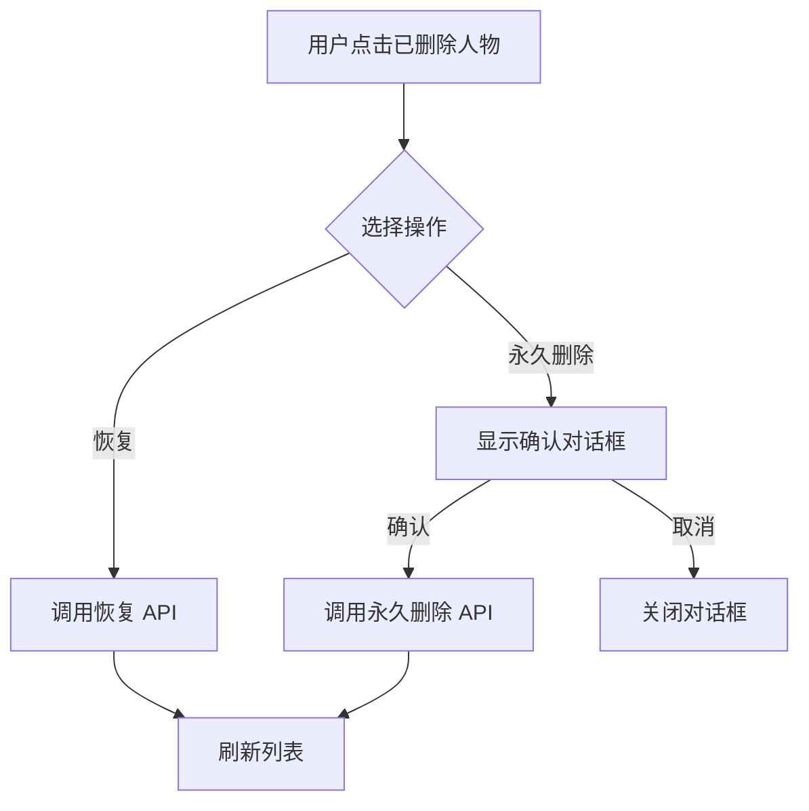
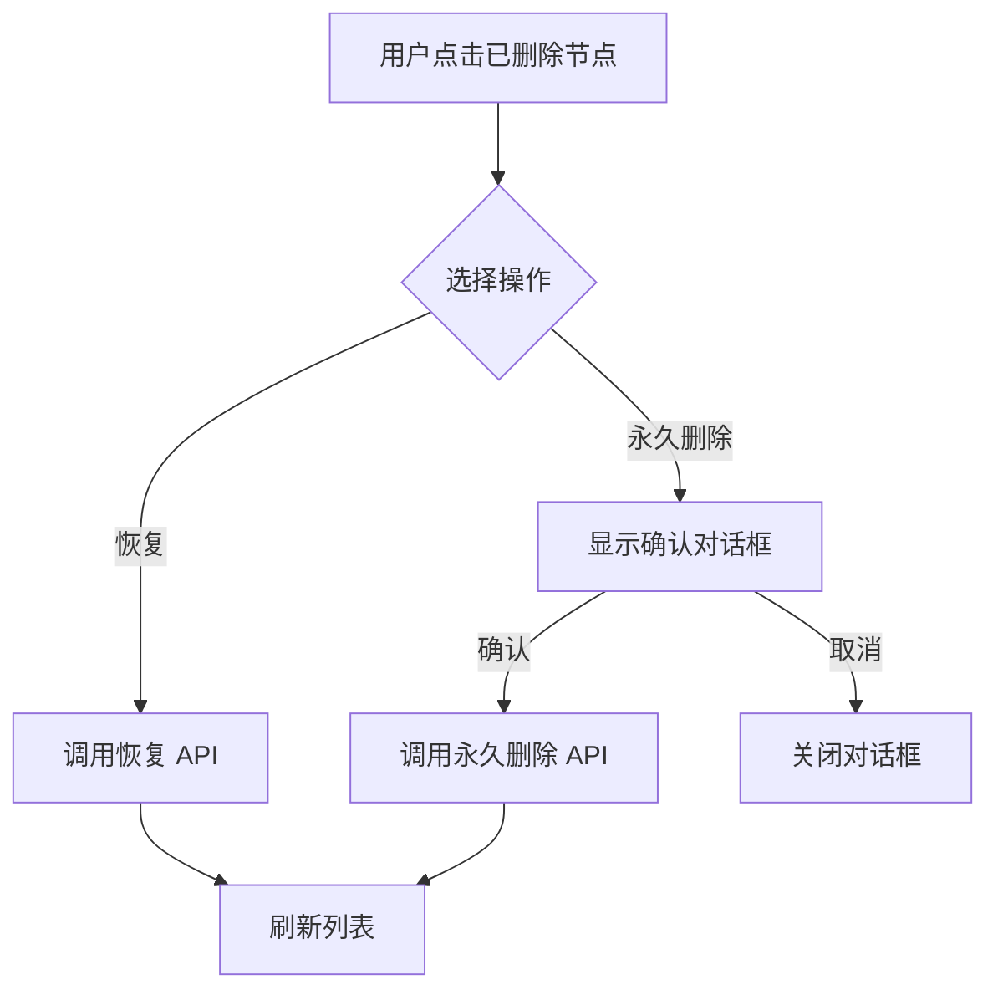

# 软删除方案设计文档

## 文档信息

- **创建日期**: 2026-03-23
- **版本**: 1.0
- **作者**: Kilo Code
- **状态**: 设计阶段

---

## 1. 概述

### 1.1 背景

当前系统使用硬删除方式删除人物和时间线节点，当 LLM 调用删除工具后，数据直接从数据库删除，用户无法恢复。这存在以下问题：

- 误删除数据无法恢复
- LLM 可能错误地删除重要数据
- 用户无法审核 LLM 的删除操作

### 1.2 目标

实现软删除机制，提供以下功能：

1. LLM 删除改为软删除（标记删除）
2. 界面显示软删除标记
3. 用户可以最终确认删除或恢复
4. LLM 查询工具限制不能查询到已软删除的数据
5. 提供回收站功能查看已删除的数据

### 1.3 设计原则

- **向后兼容**: 现有 API 尽量保持兼容
- **渐进式迁移**: 支持数据库平滑迁移
- **最小侵入**: 尽量减少对现有代码的修改
- **用户友好**: 提供清晰的删除状态提示

---

## 2. 数据库 Schema 修改

### 2.1 需要添加的字段

#### 2.1.1 characters 表

```sql
ALTER TABLE characters ADD COLUMN deleted INTEGER DEFAULT 0;
ALTER TABLE characters ADD COLUMN deleted_at INTEGER DEFAULT NULL;
```

字段说明：
- `deleted`: INTEGER 类型，0 表示未删除，1 表示已软删除
- `deleted_at`: INTEGER 类型，记录删除时间戳（秒级），NULL 表示未删除

#### 2.1.2 timeline_nodes 表

```sql
ALTER TABLE timeline_nodes ADD COLUMN deleted INTEGER DEFAULT 0;
ALTER TABLE timeline_nodes ADD COLUMN deleted_at INTEGER DEFAULT NULL;
```

字段说明：
- `deleted`: INTEGER 类型，0 表示未删除，1 表示已软删除
- `deleted_at`: INTEGER 类型，记录删除时间戳（秒级），NULL 表示未删除

### 2.2 迁移策略

#### 2.2.1 迁移 SQL

在 `src/server/db/schema.ts` 的 `getMigrationSQLs()` 函数中添加：

```typescript
export function getMigrationSQLs(): string[] {
  return [
    // ... 现有迁移
    'ALTER TABLE characters ADD COLUMN deleted INTEGER DEFAULT 0',
    'ALTER TABLE characters ADD COLUMN deleted_at INTEGER DEFAULT NULL',
    'ALTER TABLE timeline_nodes ADD COLUMN deleted INTEGER DEFAULT 0',
    'ALTER TABLE timeline_nodes ADD COLUMN deleted_at INTEGER DEFAULT NULL',
  ];
}
```

#### 2.2.2 迁移执行流程

1. 应用启动时检查数据库版本
2. 如果版本低于目标版本，执行迁移 SQL
3. 迁移成功后更新数据库版本号
4. 迁移失败时回滚并记录错误日志

#### 2.2.3 兼容性处理

- 对于新创建的数据库，字段会自动添加到 CREATE TABLE 语句中
- 对于现有数据库，通过 ALTER TABLE 添加字段
- SQLite 的 ALTER TABLE 不支持 DROP COLUMN，已删除的字段会保留但不再使用

### 2.3 版本表的处理

#### 2.3.1 版本表是否需要软删除字段？

**决策**: 版本表（`character_versions` 和 `timeline_versions`）**不添加**软删除字段。

**理由**：
1. 版本表是历史记录，不应该被删除
2. 当主表记录被永久删除时，版本表记录通过外键级联删除
3. 版本表的数据量通常不大，不需要软删除

#### 2.3.2 级联删除行为

- 当主表记录被永久删除时，版本表记录通过 `ON DELETE CASCADE` 自动删除
- 软删除不会触发级联删除
- 恢复软删除记录时，版本表数据保持不变

---

## 3. API 接口设计

### 3.1 删除接口修改

#### 3.1.1 DELETE /characters/:id

**修改前**:
```typescript
router.delete('/characters/:id', asyncHandler(async (req: Request, res: Response) => {
  const { id } = req.params;
  run('DELETE FROM characters WHERE id = ?', [id]);
  saveDB();
  res.status(204).send();
}));
```

**修改后**:
```typescript
router.delete('/characters/:id', asyncHandler(async (req: Request, res: Response) => {
  const { id } = req.params;
  
  // 检查角色是否存在
  const existingCharacters = query<DbCharacter>('SELECT * FROM characters WHERE id = ?', [id]);
  if (existingCharacters.length === 0) {
    res.status(404).json({ error: '角色未找到' });
    return;
  }
  
  // 软删除：标记为已删除
  run(
    'UPDATE characters SET deleted = 1, deleted_at = ?, updated_at = ? WHERE id = ?',
    [now(), now(), id]
  );
  saveDB();
  res.status(204).send();
}));
```

**变更说明**:
- 从 `DELETE` 改为 `UPDATE`，设置 `deleted = 1` 和 `deleted_at = now()`
- 添加存在性检查，返回 404 如果记录不存在
- 同时更新 `updated_at` 字段

#### 3.1.2 DELETE /timeline/:id

**修改前**:
```typescript
router.delete('/timeline/:id', asyncHandler(async (req: Request, res: Response) => {
  const { id } = req.params;
  run('DELETE FROM timeline_nodes WHERE id = ?', [id]);
  saveDB();
  res.status(204).send();
}));
```

**修改后**:
```typescript
router.delete('/timeline/:id', asyncHandler(async (req: Request, res: Response) => {
  const { id } = req.params;
  
  // 检查时间线节点是否存在
  const existingNodes = query<DbTimelineNode>('SELECT * FROM timeline_nodes WHERE id = ?', [id]);
  if (existingNodes.length === 0) {
    res.status(404).json({ error: '时间线节点未找到' });
    return;
  }
  
  // 软删除：标记为已删除
  run(
    'UPDATE timeline_nodes SET deleted = 1, deleted_at = ?, updated_at = ? WHERE id = ?',
    [now(), now(), id]
  );
  saveDB();
  res.status(204).send();
}));
```

**变更说明**:
- 从 `DELETE` 改为 `UPDATE`，设置 `deleted = 1` 和 `deleted_at = now()`
- 添加存在性检查，返回 404 如果记录不存在
- 同时更新 `updated_at` 字段

### 3.2 新增恢复接口

#### 3.2.1 POST /characters/:id/restore

**接口描述**: 恢复已软删除的人物

**请求参数**:
- `id` (path): 人物 ID

**响应**:
- 200: 成功，返回恢复后的人物数据
- 404: 人物未找到或未删除

**实现**:
```typescript
router.post('/characters/:id/restore', asyncHandler(async (req: Request, res: Response) => {
  const { id } = req.params;
  
  // 检查角色是否存在且已删除
  const existingCharacters = query<DbCharacter>(
    'SELECT * FROM characters WHERE id = ? AND deleted = 1',
    [id]
  );
  if (existingCharacters.length === 0) {
    res.status(404).json({ error: '角色未找到或未删除' });
    return;
  }
  
  // 恢复：标记为未删除
  run(
    'UPDATE characters SET deleted = 0, deleted_at = NULL, updated_at = ? WHERE id = ?',
    [now(), id]
  );
  saveDB();
  
  const characters = query<DbCharacter>('SELECT * FROM characters WHERE id = ?', [id]);
  res.json(formatCharacter(characters[0]));
}));
```

#### 3.2.2 POST /timeline/:id/restore

**接口描述**: 恢复已软删除的时间线节点

**请求参数**:
- `id` (path): 时间线节点 ID

**响应**:
- 200: 成功，返回恢复后的时间线节点数据
- 404: 时间线节点未找到或未删除

**实现**:
```typescript
router.post('/timeline/:id/restore', asyncHandler(async (req: Request, res: Response) => {
  const { id } = req.params;
  
  // 检查时间线节点是否存在且已删除
  const existingNodes = query<DbTimelineNode>(
    'SELECT * FROM timeline_nodes WHERE id = ? AND deleted = 1',
    [id]
  );
  if (existingNodes.length === 0) {
    res.status(404).json({ error: '时间线节点未找到或未删除' });
    return;
  }
  
  // 恢复：标记为未删除
  run(
    'UPDATE timeline_nodes SET deleted = 0, deleted_at = NULL, updated_at = ? WHERE id = ?',
    [now(), id]
  );
  saveDB();
  
  const nodes = query<DbTimelineNode>('SELECT * FROM timeline_nodes WHERE id = ?', [id]);
  res.json(formatTimelineNode(nodes[0]));
}));
```

### 3.3 新增永久删除接口

#### 3.3.1 DELETE /characters/:id/permanent

**接口描述**: 永久删除已软删除的人物（不可恢复）

**请求参数**:
- `id` (path): 人物 ID

**响应**:
- 204: 成功
- 404: 人物未找到或未删除

**实现**:
```typescript
router.delete('/characters/:id/permanent', asyncHandler(async (req: Request, res: Response) => {
  const { id } = req.params;
  
  // 检查角色是否存在且已删除
  const existingCharacters = query<DbCharacter>(
    'SELECT * FROM characters WHERE id = ? AND deleted = 1',
    [id]
  );
  if (existingCharacters.length === 0) {
    res.status(404).json({ error: '角色未找到或未删除' });
    return;
  }
  
  // 永久删除
  run('DELETE FROM characters WHERE id = ?', [id]);
  saveDB();
  res.status(204).send();
}));
```

#### 3.3.2 DELETE /timeline/:id/permanent

**接口描述**: 永久删除已软删除的时间线节点（不可恢复）

**请求参数**:
- `id` (path): 时间线节点 ID

**响应**:
- 204: 成功
- 404: 时间线节点未找到或未删除

**实现**:
```typescript
router.delete('/timeline/:id/permanent', asyncHandler(async (req: Request, res: Response) => {
  const { id } = req.params;
  
  // 检查时间线节点是否存在且已删除
  const existingNodes = query<DbTimelineNode>(
    'SELECT * FROM timeline_nodes WHERE id = ? AND deleted = 1',
    [id]
  );
  if (existingNodes.length === 0) {
    res.status(404).json({ error: '时间线节点未找到或未删除' });
    return;
  }
  
  // 永久删除
  run('DELETE FROM timeline_nodes WHERE id = ?', [id]);
  saveDB();
  res.status(204).send();
}));
```

### 3.4 查询接口修改

#### 3.4.1 GET /projects/:projectId/characters

**修改前**:
```typescript
let sql = 'SELECT * FROM characters WHERE project_id = ?';
```

**修改后**:
```typescript
let sql = 'SELECT * FROM characters WHERE project_id = ? AND deleted = 0';
```

**变更说明**:
- 添加 `AND deleted = 0` 条件，过滤已软删除的记录

#### 3.4.2 GET /projects/:projectId/timeline

**修改前**:
```typescript
let sql = 'SELECT * FROM timeline_nodes WHERE project_id = ?';
```

**修改后**:
```typescript
let sql = 'SELECT * FROM timeline_nodes WHERE project_id = ? AND deleted = 0';
```

**变更说明**:
- 添加 `AND deleted = 0` 条件，过滤已软删除的记录

#### 3.4.3 GET /characters/:id

**修改前**:
```typescript
const characters = query<DbCharacter>('SELECT * FROM characters WHERE id = ?', [id]);
```

**修改后**:
```typescript
const characters = query<DbCharacter>(
  'SELECT * FROM characters WHERE id = ? AND deleted = 0',
  [id]
);
```

**变更说明**:
- 添加 `AND deleted = 0` 条件，不返回已软删除的记录

#### 3.4.4 GET /timeline/:id

**修改前**:
```typescript
const nodes = query<DbTimelineNode>('SELECT * FROM timeline_nodes WHERE id = ?', [id]);
```

**修改后**:
```typescript
const nodes = query<DbTimelineNode>(
  'SELECT * FROM timeline_nodes WHERE id = ? AND deleted = 0',
  [id]
);
```

**变更说明**:
- 添加 `AND deleted = 0` 条件，不返回已软删除的记录

### 3.5 新增回收站接口

#### 3.5.1 GET /projects/:projectId/characters/trash

**接口描述**: 获取项目的已删除人物列表

**请求参数**:
- `projectId` (path): 项目 ID
- `name` (query, 可选): 按姓名筛选
- `personality` (query, 可选): 按性格筛选
- `background` (query, 可选): 按背景筛选

**响应**:
- 200: 成功，返回已删除人物列表

**实现**:
```typescript
router.get('/projects/:projectId/characters/trash', asyncHandler(async (req: Request, res: Response) => {
  const { projectId } = req.params;
  const { name, personality, background } = req.query as GetCharactersQuery;

  let sql = 'SELECT * FROM characters WHERE project_id = ? AND deleted = 1';
  const params: (string | number)[] = [projectId];

  if (name) {
    sql += ' AND name LIKE ?';
    params.push(`%${name}%`);
  }

  if (personality) {
    sql += ' AND personality LIKE ?';
    params.push(`%${personality}%`);
  }

  if (background) {
    sql += ' AND background LIKE ?';
    params.push(`%${background}%`);
  }

  sql += ' ORDER BY deleted_at DESC';

  const characters = query<DbCharacter>(sql, params);
  const formattedCharacters = characters.map(formatCharacter);
  res.json(formattedCharacters);
}));
```

#### 3.5.2 GET /projects/:projectId/timeline/trash

**接口描述**: 获取项目的已删除时间线节点列表

**请求参数**:
- `projectId` (path): 项目 ID
- `title` (query, 可选): 按标题筛选
- `content` (query, 可选): 按内容筛选

**响应**:
- 200: 成功，返回已删除时间线节点列表

**实现**:
```typescript
router.get('/projects/:projectId/timeline/trash', asyncHandler(async (req: Request, res: Response) => {
  const { projectId } = req.params;
  const { title, content } = req.query as GetTimelineNodesQuery;
  
  let sql = 'SELECT * FROM timeline_nodes WHERE project_id = ? AND deleted = 1';
  const params: (string | number)[] = [projectId];
  
  if (title) {
    sql += ' AND title LIKE ?';
    params.push(`%${title}%`);
  }

  if (content) {
    sql += ' AND content LIKE ?';
    params.push(`%${content}%`);
  }

  sql += ' ORDER BY deleted_at DESC';

  const nodes = query<DbTimelineNode>(sql, params);
  const formattedNodes = nodes.map(n => formatTimelineNode(n));
  res.json(formattedNodes);
}));
```

### 3.6 API 接口汇总表

| 方法 | 路径 | 描述 | 变更类型 |
|------|------|------|----------|
| GET | /projects/:projectId/characters | 获取人物列表 | 修改（添加 deleted 过滤） |
| GET | /projects/:projectId/timeline | 获取时间线节点列表 | 修改（添加 deleted 过滤） |
| GET | /characters/:id | 获取单个人物 | 修改（添加 deleted 过滤） |
| GET | /timeline/:id | 获取单个时间线节点 | 修改（添加 deleted 过滤） |
| DELETE | /characters/:id | 删除人物 | 修改（改为软删除） |
| DELETE | /timeline/:id | 删除时间线节点 | 修改（改为软删除） |
| POST | /characters/:id/restore | 恢复人物 | 新增 |
| POST | /timeline/:id/restore | 恢复时间线节点 | 新增 |
| DELETE | /characters/:id/permanent | 永久删除人物 | 新增 |
| DELETE | /timeline/:id/permanent | 永久删除时间线节点 | 新增 |
| GET | /projects/:projectId/characters/trash | 获取已删除人物列表 | 新增 |
| GET | /projects/:projectId/timeline/trash | 获取已删除时间线节点列表 | 新增 |

---

## 4. 类型定义更新

### 4.1 共享类型修改

#### 4.1.1 Character 接口

**修改前**:
```typescript
export interface Character {
  id: string;
  projectId: string;
  name: string;
  personality?: string;
  background?: string;
  relationships?: string;
  createdAt: number;
}
```

**修改后**:
```typescript
export interface Character {
  id: string;
  projectId: string;
  name: string;
  personality?: string;
  background?: string;
  relationships?: string;
  createdAt: number;
  /** 是否已删除（软删除标记） */
  deleted?: boolean;
  /** 删除时间戳（秒，可选） */
  deletedAt?: number;
}
```

#### 4.1.2 TimelineNode 接口

**修改前**:
```typescript
export interface TimelineNode {
  id: string;
  projectId: string;
  title: string;
  date: string;
  description: string;
  content?: string;
  orderIndex: number;
  createdAt: number;
}
```

**修改后**:
```typescript
export interface TimelineNode {
  id: string;
  projectId: string;
  title: string;
  date: string;
  description: string;
  content?: string;
  orderIndex: number;
  createdAt: number;
  /** 是否已删除（软删除标记） */
  deleted?: boolean;
  /** 删除时间戳（秒，可选） */
  deletedAt?: number;
}
```

### 4.2 数据库类型修改

#### 4.2.1 DbCharacter 接口

**修改前**:
```typescript
export interface DbCharacter {
  id: string;
  project_id: string;
  name: string;
  personality: string | null;
  background: string | null;
  relationships: string | null;
  created_at: number;
  updated_at: number;
}
```

**修改后**:
```typescript
export interface DbCharacter {
  id: string;
  project_id: string;
  name: string;
  personality: string | null;
  background: string | null;
  relationships: string | null;
  created_at: number;
  updated_at: number;
  /** 是否已删除（0: 未删除, 1: 已删除） */
  deleted: number;
  /** 删除时间戳（秒，可选） */
  deleted_at: number | null;
}
```

#### 4.2.2 DbTimelineNode 接口

**修改前**:
```typescript
export interface DbTimelineNode {
  id: string;
  project_id: string;
  title: string;
  date: string | null;
  content: string | null;
  order_index: number;
  created_at: number;
  updated_at: number;
}
```

**修改后**:
```typescript
export interface DbTimelineNode {
  id: string;
  project_id: string;
  title: string;
  date: string | null;
  content: string | null;
  order_index: number;
  created_at: number;
  updated_at: number;
  /** 是否已删除（0: 未删除, 1: 已删除） */
  deleted: number;
  /** 删除时间戳（秒，可选） */
  deleted_at: number | null;
}
```

### 4.3 格式化函数更新

#### 4.3.1 formatCharacter 函数

**修改前** (`src/server/utils/formatters.ts`):
```typescript
export function formatCharacter(dbCharacter: DbCharacter): Character {
  return {
    id: dbCharacter.id,
    projectId: dbCharacter.project_id,
    name: dbCharacter.name,
    personality: dbCharacter.personality || undefined,
    background: dbCharacter.background || undefined,
    relationships: dbCharacter.relationships || undefined,
    createdAt: dbCharacter.created_at,
  };
}
```

**修改后**:
```typescript
export function formatCharacter(dbCharacter: DbCharacter): Character {
  return {
    id: dbCharacter.id,
    projectId: dbCharacter.project_id,
    name: dbCharacter.name,
    personality: dbCharacter.personality || undefined,
    background: dbCharacter.background || undefined,
    relationships: dbCharacter.relationships || undefined,
    createdAt: dbCharacter.created_at,
    deleted: dbCharacter.deleted === 1,
    deletedAt: dbCharacter.deleted_at || undefined,
  };
}
```

#### 4.3.2 formatTimelineNode 函数

**修改前** (`src/server/utils/formatters.ts`):
```typescript
export function formatTimelineNode(dbNode: DbTimelineNode): TimelineNode {
  return {
    id: dbNode.id,
    projectId: dbNode.project_id,
    title: dbNode.title,
    date: dbNode.date || '',
    description: dbNode.content || '',
    content: dbNode.content || undefined,
    orderIndex: dbNode.order_index,
    createdAt: dbNode.created_at,
  };
}
```

**修改后**:
```typescript
export function formatTimelineNode(dbNode: DbTimelineNode): TimelineNode {
  return {
    id: dbNode.id,
    projectId: dbNode.project_id,
    title: dbNode.title,
    date: dbNode.date || '',
    description: dbNode.content || '',
    content: dbNode.content || undefined,
    orderIndex: dbNode.order_index,
    createdAt: dbNode.created_at,
    deleted: dbNode.deleted === 1,
    deletedAt: dbNode.deleted_at || undefined,
  };
}
```

---

## 5. 前端界面设计

### 5.1 软删除标记显示

#### 5.1.1 人物列表显示

在人物列表中，已删除的人物应该：

1. **视觉标记**:
   - 显示删除图标（如：`<Delete />` 或 `<Warning />`）
   - 使用灰色或半透明样式
   - 添加"已删除"标签

2. **位置**:
   - 在人物名称旁边显示删除标记
   - 或在列表项的右侧显示删除状态

3. **示例**:
```vue
<div class="character-item" :class="{ 'is-deleted': character.deleted }">
  <span class="character-name">{{ character.name }}</span>
  <el-tag v-if="character.deleted" type="info" size="small">已删除</el-tag>
  <el-tag v-else-if="character.deletedAt" type="danger" size="small">
    {{ formatTime(character.deletedAt) }}
  </el-tag>
</div>
```

#### 5.1.2 时间线节点列表显示

在时间线节点列表中，已删除的节点应该：

1. **视觉标记**:
   - 显示删除图标
   - 使用灰色或半透明样式
   - 添加"已删除"标签

2. **位置**:
   - 在节点标题旁边显示删除标记
   - 或在列表项的右侧显示删除状态

3. **示例**:
```vue
<div class="timeline-item" :class="{ 'is-deleted': node.deleted }">
  <span class="timeline-title">{{ node.title }}</span>
  <el-tag v-if="node.deleted" type="info" size="small">已删除</el-tag>
</div>
```

### 5.2 恢复和永久删除交互流程

#### 5.2.1 人物的恢复/删除流程

**流程图**:



**实现示例**:
```vue
<template>
  <el-dropdown @command="handleCommand">
    <el-button type="primary">
      操作 <el-icon><arrow-down /></el-icon>
    </el-button>
    <template #dropdown>
      <el-dropdown-menu>
        <el-dropdown-item command="restore" :disabled="!character.deleted">
          恢复
        </el-dropdown-item>
        <el-dropdown-item command="delete" :disabled="character.deleted">
          删除
        </el-dropdown-item>
        <el-dropdown-item 
          command="permanent-delete" 
          :disabled="!character.deleted"
          divided
        >
          永久删除
        </el-dropdown-item>
      </el-dropdown-menu>
    </template>
  </el-dropdown>
</template>

<script setup lang="ts">
const handleCommand = async (command: string) => {
  if (command === 'restore') {
    await characterApi.restore(character.id);
    ElMessage.success('恢复成功');
  } else if (command === 'delete') {
    await characterApi.delete(character.id);
    ElMessage.success('删除成功');
  } else if (command === 'permanent-delete') {
    await ElMessageBox.confirm(
      '永久删除后无法恢复，确定要删除吗？',
      '警告',
      {
        confirmButtonText: '确定',
        cancelButtonText: '取消',
        type: 'warning',
      }
    );
    await characterApi.permanentDelete(character.id);
    ElMessage.success('永久删除成功');
  }
  // 刷新列表
  await loadCharacters();
};
</script>
```

#### 5.2.2 时间线节点的恢复/删除流程

**流程图**:



**实现示例**:
```vue
<template>
  <el-dropdown @command="handleCommand">
    <el-button type="primary">
      操作 <el-icon><arrow-down /></el-icon>
    </el-button>
    <template #dropdown>
      <el-dropdown-menu>
        <el-dropdown-item command="restore" :disabled="!node.deleted">
          恢复
        </el-dropdown-item>
        <el-dropdown-item command="delete" :disabled="node.deleted">
          删除
        </el-dropdown-item>
        <el-dropdown-item 
          command="permanent-delete" 
          :disabled="!node.deleted"
          divided
        >
          永久删除
        </el-dropdown-item>
      </el-dropdown-menu>
    </template>
  </el-dropdown>
</template>

<script setup lang="ts">
const handleCommand = async (command: string) => {
  if (command === 'restore') {
    await timelineApi.restore(node.id);
    ElMessage.success('恢复成功');
  } else if (command === 'delete') {
    await timelineApi.delete(node.id);
    ElMessage.success('删除成功');
  } else if (command === 'permanent-delete') {
    await ElMessageBox.confirm(
      '永久删除后无法恢复，确定要删除吗？',
      '警告',
      {
        confirmButtonText: '确定',
        cancelButtonText: '取消',
        type: 'warning',
      }
    );
    await timelineApi.permanentDelete(node.id);
    ElMessage.success('永久删除成功');
  }
  // 刷新列表
  await loadTimeline();
};
</script>
```

### 5.3 回收站功能

#### 5.3.1 回收站入口

在主界面添加回收站入口：

1. **位置**: 在侧边栏或顶部导航栏
2. **图标**: 使用垃圾桶图标（`<Delete />`）
3. **标签**: "回收站"
4. **数量提示**: 显示已删除项目的数量

**示例**:
```vue
<el-menu-item @click="showTrash">
  <el-icon><delete /></el-icon>
  <span>回收站</span>
  <el-badge 
    v-if="trashCount > 0" 
    :value="trashCount" 
    class="trash-badge"
  />
</el-menu-item>
```

#### 5.3.2 回收站页面

回收站页面应该包含：

1. **Tab 切换**:
   - 人物 Tab
   - 时间线节点 Tab

2. **列表显示**:
   - 显示已删除的项目列表
   - 按删除时间倒序排列
   - 显示删除时间

3. **操作按钮**:
   - 恢复按钮
   - 永久删除按钮
   - 批量操作按钮

4. **筛选功能**:
   - 按名称/标题筛选
   - 按删除时间范围筛选

**示例**:
```vue
<template>
  <div class="trash-page">
    <el-tabs v-model="activeTab">
      <el-tab-pane label="人物" name="characters">
        <div class="toolbar">
          <el-input
            v-model="searchName"
            placeholder="搜索姓名"
            clearable
          />
          <el-button 
            type="primary" 
            @click="batchRestore"
            :disabled="selectedCharacters.length === 0"
          >
            批量恢复
          </el-button>
          <el-button 
            type="danger" 
            @click="batchPermanentDelete"
            :disabled="selectedCharacters.length === 0"
          >
            批量永久删除
          </el-button>
        </div>
        <el-table
          :data="deletedCharacters"
          @selection-change="handleCharacterSelection"
        >
          <el-table-column type="selection" width="55" />
          <el-table-column prop="name" label="姓名" />
          <el-table-column prop="deletedAt" label="删除时间">
            <template #default="{ row }">
              {{ formatTime(row.deletedAt) }}
            </template>
          </el-table-column>
          <el-table-column label="操作" width="200">
            <template #default="{ row }">
              <el-button 
                type="primary" 
                size="small" 
                @click="restoreCharacter(row.id)"
              >
                恢复
              </el-button>
              <el-button 
                type="danger" 
                size="small" 
                @click="permanentDeleteCharacter(row.id)"
              >
                永久删除
              </el-button>
            </template>
          </el-table-column>
        </el-table>
      </el-tab-pane>
      
      <el-tab-pane label="时间线节点" name="timeline">
        <div class="toolbar">
          <el-input
            v-model="searchTitle"
            placeholder="搜索标题"
            clearable
          />
          <el-button 
            type="primary" 
            @click="batchRestoreTimeline"
            :disabled="selectedTimeline.length === 0"
          >
            批量恢复
          </el-button>
          <el-button 
            type="danger" 
            @click="batchPermanentDeleteTimeline"
            :disabled="selectedTimeline.length === 0"
          >
            批量永久删除
          </el-button>
        </div>
        <el-table
          :data="deletedTimeline"
          @selection-change="handleTimelineSelection"
        >
          <el-table-column type="selection" width="55" />
          <el-table-column prop="title" label="标题" />
          <el-table-column prop="date" label="日期" />
          <el-table-column prop="deletedAt" label="删除时间">
            <template #default="{ row }">
              {{ formatTime(row.deletedAt) }}
            </template>
          </el-table-column>
          <el-table-column label="操作" width="200">
            <template #default="{ row }">
              <el-button 
                type="primary" 
                size="small" 
                @click="restoreTimeline(row.id)"
              >
                恢复
              </el-button>
              <el-button 
                type="danger" 
                size="small" 
                @click="permanentDeleteTimeline(row.id)"
              >
                永久删除
              </el-button>
            </template>
          </el-table-column>
        </el-table>
      </el-tab-pane>
    </el-tabs>
  </div>
</template>
```

#### 5.3.3 回收站数据加载

**API 调用**:
```typescript
// 加载已删除的人物
const loadDeletedCharacters = async () => {
  const response = await characterApi.getTrash(projectId);
  deletedCharacters.value = response.data;
};

// 加载已删除的时间线节点
const loadDeletedTimeline = async () => {
  const response = await timelineApi.getTrash(projectId);
  deletedTimeline.value = response.data;
};
```

### 5.4 样式设计

#### 5.4.1 已删除项目的样式

```css
/* 已删除项目的样式 */
.is-deleted {
  opacity: 0.6;
  background-color: #f5f5f5;
}

.is-deleted .character-name,
.is-deleted .timeline-title {
  color: #999;
  text-decoration: line-through;
}

/* 回收站徽章样式 */
.trash-badge {
  margin-left: 8px;
}
```

#### 5.4.2 回收站页面样式

```css
/* 回收站页面样式 */
.trash-page {
  padding: 20px;
}

.trash-page .toolbar {
  margin-bottom: 20px;
  display: flex;
  gap: 10px;
}

.trash-page .el-table {
  margin-top: 20px;
}
```

---

## 6. LLM 工具更新

### 6.1 删除工具描述修改

#### 6.1.1 delete_character 工具

**修改前**:
```typescript
export const deleteCharacterTool: ToolDefinition = {
  type: 'function',
  function: {
    name: 'delete_character',
    description: '删除指定的人物角色',
    strict: true,
    parameters: {
      type: 'object',
      properties: {
        id: {
          type: 'string',
          description: '人物的 ID',
        },
      },
      required: ['id'],
      additionalProperties: false,
    },
  },
};
```

**修改后**:
```typescript
export const deleteCharacterTool: ToolDefinition = {
  type: 'function',
  function: {
    name: 'delete_character',
    description: '删除指定的人物角色（软删除，可恢复）。删除后人物会进入回收站，用户可以恢复或永久删除。',
    strict: true,
    parameters: {
      type: 'object',
      properties: {
        id: {
          type: 'string',
          description: '人物的 ID',
        },
      },
      required: ['id'],
      additionalProperties: false,
    },
  },
};
```

**变更说明**:
- 更新描述，说明是软删除
- 提及删除后可恢复
- 提及回收站功能

#### 6.1.2 delete_timeline 工具

**修改前**:
```typescript
export const deleteTimelineTool: ToolDefinition = {
  type: 'function',
  function: {
    name: 'delete_timeline',
    description: '删除指定的时间线节点',
    strict: true,
    parameters: {
      type: 'object',
      properties: {
        id: {
          type: 'string',
          description: '时间线节点的 ID',
        },
      },
      required: ['id'],
      additionalProperties: false,
    },
  },
};
```

**修改后**:
```typescript
export const deleteTimelineTool: ToolDefinition = {
  type: 'function',
  function: {
    name: 'delete_timeline',
    description: '删除指定的时间线节点（软删除，可恢复）。删除后节点会进入回收站，用户可以恢复或永久删除。',
    strict: true,
    parameters: {
      type: 'object',
      properties: {
        id: {
          type: 'string',
          description: '时间线节点的 ID',
        },
      },
      required: ['id'],
      additionalProperties: false,
    },
  },
};
```

**变更说明**:
- 更新描述，说明是软删除
- 提及删除后可恢复
- 提及回收站功能

### 6.2 是否需要新增恢复工具？

**决策**: **不新增**恢复工具给 LLM 使用。

**理由**:
1. 恢复操作应该由用户手动确认，不应该由 LLM 自动执行
2. LLM 的职责是协助创作，而不是管理删除状态
3. 避免循环删除和恢复的问题

### 6.3 查询工具限制

#### 6.3.1 get_character 工具

**当前实现**:
```typescript
export const getCharacterTool: ToolDefinition = {
  type: 'function',
  function: {
    name: 'get_character',
    description: '查询人物列表。可以通过 ID、姓名、描述、性格或背景进行筛选。如果提供 id 参数，则返回指定 ID 的人物详情；否则返回筛选后的人物列表。',
    strict: true,
    parameters: {
      type: 'object',
      properties: {
        id: {
          type: 'string',
          description: '人物的 ID（可选，提供则返回指定 ID 的人物详情）',
        },
        name: {
          type: 'string',
          description: '按姓名筛选（可选，模糊匹配）',
        },
        description: {
          type: 'string',
          description: '按描述筛选（可选，模糊匹配）',
        },
        personality: {
          type: 'string',
          description: '按性格筛选（可选，模糊匹配）',
        },
        background: {
          type: 'string',
          description: '按背景筛选（可选，模糊匹配）',
        },
      },
      required: [],
      additionalProperties: false,
    },
  },
};
```

**修改后**:
```typescript
export const getCharacterTool: ToolDefinition = {
  type: 'function',
  function: {
    name: 'get_character',
    description: '查询人物列表。可以通过 ID、姓名、描述、性格或背景进行筛选。如果提供 id 参数，则返回指定 ID 的人物详情；否则返回筛选后的人物列表。注意：此工具只能查询未删除的人物，已删除的人物不会返回。',
    strict: true,
    parameters: {
      type: 'object',
      properties: {
        id: {
          type: 'string',
          description: '人物的 ID（可选，提供则返回指定 ID 的人物详情）',
        },
        name: {
          type: 'string',
          description: '按姓名筛选（可选，模糊匹配）',
        },
        description: {
          type: 'string',
          description: '按描述筛选（可选，模糊匹配）',
        },
        personality: {
          type: 'string',
          description: '按性格筛选（可选，模糊匹配）',
        },
        background: {
          type: 'string',
          description: '按背景筛选（可选，模糊匹配）',
        },
      },
      required: [],
      additionalProperties: false,
    },
  },
};
```

**变更说明**:
- 在描述中添加说明：只能查询未删除的人物
- 明确已删除的人物不会返回

#### 6.3.2 get_timeline 工具

**当前实现**:
```typescript
export const getTimelineTool: ToolDefinition = {
  type: 'function',
  function: {
    name: 'get_timeline',
    description: '查询时间线节点列表。可以通过 ID、标题或内容进行筛选。如果提供 id 参数，则返回指定 ID 的节点详情；否则返回筛选后的节点列表。',
    strict: true,
    parameters: {
      type: 'object',
      properties: {
        id: {
          type: 'string',
          description: '时间线节点的 ID（可选，提供则返回指定 ID 的节点详情）',
        },
        title: {
          type: 'string',
          description: '按标题筛选（可选，模糊匹配）',
        },
        content: {
          type: 'string',
          description: '按内容筛选（可选，模糊匹配）',
        },
      },
      required: [],
      additionalProperties: false,
    },
  },
};
```

**修改后**:
```typescript
export const getTimelineTool: ToolDefinition = {
  type: 'function',
  function: {
    name: 'get_timeline',
    description: '查询时间线节点列表。可以通过 ID、标题或内容进行筛选。如果提供 id 参数，则返回指定 ID 的节点详情；否则返回筛选后的节点列表。注意：此工具只能查询未删除的时间线节点，已删除的节点不会返回。',
    strict: true,
    parameters: {
      type: 'object',
      properties: {
        id: {
          type: 'string',
          description: '时间线节点的 ID（可选，提供则返回指定 ID 的节点详情）',
        },
        title: {
          type: 'string',
          description: '按标题筛选（可选，模糊匹配）',
        },
        content: {
          type: 'string',
          description: '按内容筛选（可选，模糊匹配）',
        },
      },
      required: [],
      additionalProperties: false,
    },
  },
};
```

**变更说明**:
- 在描述中添加说明：只能查询未删除的时间线节点
- 明确已删除的节点不会返回

### 6.4 LLM 工具汇总表

| 工具名称 | 变更类型 | 变更说明 |
|---------|---------|---------|
| delete_character | 修改 | 更新描述，说明是软删除 |
| delete_timeline | 修改 | 更新描述，说明是软删除 |
| get_character | 修改 | 更新描述，说明只能查询未删除的人物 |
| get_timeline | 修改 | 更新描述，说明只能查询未删除的节点 |
| restore_character | 不新增 | 不提供恢复工具给 LLM |
| restore_timeline | 不新增 | 不提供恢复工具给 LLM |

---

## 7. 实施步骤

### 7.1 按优先级列出的实施步骤

#### 阶段 1：数据库层（高优先级）

1. **修改数据库 Schema**
   - 在 `src/server/db/schema.ts` 中添加软删除字段
   - 更新 `getCreateTablesSQL()` 函数
   - 添加迁移 SQL 到 `getMigrationSQLs()` 函数

2. **更新数据库类型定义**
   - 在 `src/shared/types.ts` 中更新 `DbCharacter` 接口
   - 在 `src/shared/types.ts` 中更新 `DbTimelineNode` 接口

3. **更新格式化函数**
   - 在 `src/server/utils/formatters.ts` 中更新 `formatCharacter()` 函数
   - 在 `src/server/utils/formatters.ts` 中更新 `formatTimelineNode()` 函数

4. **测试数据库迁移**
   - 在测试环境中执行迁移
   - 验证字段添加成功
   - 验证现有数据不受影响

#### 阶段 2：后端 API 层（高优先级）

5. **修改删除接口**
   - 修改 `DELETE /characters/:id` 为软删除
   - 修改 `DELETE /timeline/:id` 为软删除

6. **修改查询接口**
   - 修改 `GET /projects/:projectId/characters` 添加 deleted 过滤
   - 修改 `GET /projects/:projectId/timeline` 添加 deleted 过滤
   - 修改 `GET /characters/:id` 添加 deleted 过滤
   - 修改 `GET /timeline/:id` 添加 deleted 过滤

7. **新增恢复接口**
   - 新增 `POST /characters/:id/restore`
   - 新增 `POST /timeline/:id/restore`

8. **新增永久删除接口**
   - 新增 `DELETE /characters/:id/permanent`
   - 新增 `DELETE /timeline/:id/permanent`

9. **新增回收站接口**
   - 新增 `GET /projects/:projectId/characters/trash`
   - 新增 `GET /projects/:projectId/timeline/trash`

10. **测试 API 接口**
    - 测试软删除功能
    - 测试恢复功能
    - 测试永久删除功能
    - 测试回收站查询功能

#### 阶段 3：前端 API 层（中优先级）

11. **更新前端 API 函数**
    - 在 `src/renderer/utils/api.ts` 中更新 `characterApi.delete()` 为软删除
    - 在 `src/renderer/utils/api.ts` 中更新 `timelineApi.delete()` 为软删除
    - 在 `src/renderer/utils/api.ts` 中添加 `characterApi.restore()`
    - 在 `src/renderer/utils/api.ts` 中添加 `timelineApi.restore()`
    - 在 `src/renderer/utils/api.ts` 中添加 `characterApi.permanentDelete()`
    - 在 `src/renderer/utils/api.ts` 中添加 `timelineApi.permanentDelete()`
    - 在 `src/renderer/utils/api.ts` 中添加 `characterApi.getTrash()`
    - 在 `src/renderer/utils/api.ts` 中添加 `timelineApi.getTrash()`

12. **更新前端类型定义**
    - 在 `src/shared/types.ts` 中更新 `Character` 接口
    - 在 `src/shared/types.ts` 中更新 `TimelineNode` 接口

#### 阶段 4：前端界面层（中优先级）

13. **更新人物面板**
    - 在人物列表中显示软删除标记
    - 添加恢复和永久删除按钮
    - 更新删除操作为软删除

14. **更新时间线面板**
    - 在时间线节点列表中显示软删除标记
    - 添加恢复和永久删除按钮
    - 更新删除操作为软删除

15. **创建回收站页面**
    - 创建回收站组件
    - 添加 Tab 切换（人物/时间线）
    - 实现列表显示和操作按钮
    - 实现批量操作功能

16. **添加回收站入口**
    - 在主界面添加回收站入口
    - 添加已删除数量提示

17. **添加样式**
    - 添加已删除项目的样式
    - 添加回收站页面的样式

#### 阶段 5：LLM 工具层（低优先级）

18. **更新删除工具描述**
    - 更新 `delete_character` 工具描述
    - 更新 `delete_timeline` 工具描述

19. **更新查询工具描述**
    - 更新 `get_character` 工具描述
    - 更新 `get_timeline` 工具描述

#### 阶段 6：测试和文档（中优先级）

20. **集成测试**
    - 测试完整的软删除流程
    - 测试恢复流程
    - 测试永久删除流程
    - 测试 LLM 删除后的查询限制

21. **编写用户文档**
    - 编写软删除功能使用说明
    - 编写回收站功能使用说明

22. **更新项目文档**
    - 更新 README.md
    - 更新 API 文档

### 7.2 每个步骤的具体内容

#### 步骤 1：修改数据库 Schema

**文件**: `src/server/db/schema.ts`

**操作**:
1. 在 `getCreateTablesSQL()` 函数中，为 `characters` 表添加字段：
```sql
deleted INTEGER DEFAULT 0,
deleted_at INTEGER DEFAULT NULL,
```

2. 在 `getCreateTablesSQL()` 函数中，为 `timeline_nodes` 表添加字段：
```sql
deleted INTEGER DEFAULT 0,
deleted_at INTEGER DEFAULT NULL,
```

3. 在 `getMigrationSQLs()` 函数中添加迁移 SQL：
```typescript
'ALTER TABLE characters ADD COLUMN deleted INTEGER DEFAULT 0',
'ALTER TABLE characters ADD COLUMN deleted_at INTEGER DEFAULT NULL',
'ALTER TABLE timeline_nodes ADD COLUMN deleted INTEGER DEFAULT 0',
'ALTER TABLE timeline_nodes ADD COLUMN deleted_at INTEGER DEFAULT NULL',
```

**验证**:
- 新建数据库时字段自动添加
- 现有数据库通过迁移添加字段

#### 步骤 2：更新数据库类型定义

**文件**: `src/shared/types.ts`

**操作**:
1. 更新 `DbCharacter` 接口：
```typescript
export interface DbCharacter {
  id: string;
  project_id: string;
  name: string;
  personality: string | null;
  background: string | null;
  relationships: string | null;
  created_at: number;
  updated_at: number;
  deleted: number;
  deleted_at: number | null;
}
```

2. 更新 `DbTimelineNode` 接口：
```typescript
export interface DbTimelineNode {
  id: string;
  project_id: string;
  title: string;
  date: string | null;
  content: string | null;
  order_index: number;
  created_at: number;
  updated_at: number;
  deleted: number;
  deleted_at: number | null;
}
```

#### 步骤 3：更新格式化函数

**文件**: `src/server/utils/formatters.ts`

**操作**:
1. 更新 `formatCharacter()` 函数：
```typescript
export function formatCharacter(dbCharacter: DbCharacter): Character {
  return {
    id: dbCharacter.id,
    projectId: dbCharacter.project_id,
    name: dbCharacter.name,
    personality: dbCharacter.personality || undefined,
    background: dbCharacter.background || undefined,
    relationships: dbCharacter.relationships || undefined,
    createdAt: dbCharacter.created_at,
    deleted: dbCharacter.deleted === 1,
    deletedAt: dbCharacter.deleted_at || undefined,
  };
}
```

2. 更新 `formatTimelineNode()` 函数：
```typescript
export function formatTimelineNode(dbNode: DbTimelineNode): TimelineNode {
  return {
    id: dbNode.id,
    projectId: dbNode.project_id,
    title: dbNode.title,
    date: dbNode.date || '',
    description: dbNode.content || '',
    content: dbNode.content || undefined,
    orderIndex: dbNode.order_index,
    createdAt: dbNode.created_at,
    deleted: dbNode.deleted === 1,
    deletedAt: dbNode.deleted_at || undefined,
  };
}
```

#### 步骤 4：测试数据库迁移

**操作**:
1. 在测试环境中启动应用
2. 检查数据库是否成功添加字段
3. 验证现有数据不受影响
4. 验证新数据字段默认值正确

#### 步骤 5：修改删除接口

**文件**: `src/server/routes/characters.ts`, `src/server/routes/timeline.ts`

**操作**:
1. 修改 `DELETE /characters/:id` 为软删除（参考 3.1.1）
2. 修改 `DELETE /timeline/:id` 为软删除（参考 3.1.2）

#### 步骤 6：修改查询接口

**文件**: `src/server/routes/characters.ts`, `src/server/routes/timeline.ts`

**操作**:
1. 修改 `GET /projects/:projectId/characters` 添加 `AND deleted = 0`（参考 3.4.1）
2. 修改 `GET /projects/:projectId/timeline` 添加 `AND deleted = 0`（参考 3.4.2）
3. 修改 `GET /characters/:id` 添加 `AND deleted = 0`（参考 3.4.3）
4. 修改 `GET /timeline/:id` 添加 `AND deleted = 0`（参考 3.4.4）

#### 步骤 7：新增恢复接口

**文件**: `src/server/routes/characters.ts`, `src/server/routes/timeline.ts`

**操作**:
1. 新增 `POST /characters/:id/restore`（参考 3.2.1）
2. 新增 `POST /timeline/:id/restore`（参考 3.2.2）

#### 步骤 8：新增永久删除接口

**文件**: `src/server/routes/characters.ts`, `src/server/routes/timeline.ts`

**操作**:
1. 新增 `DELETE /characters/:id/permanent`（参考 3.3.1）
2. 新增 `DELETE /timeline/:id/permanent`（参考 3.3.2）

#### 步骤 9：新增回收站接口

**文件**: `src/server/routes/characters.ts`, `src/server/routes/timeline.ts`

**操作**:
1. 新增 `GET /projects/:projectId/characters/trash`（参考 3.5.1）
2. 新增 `GET /projects/:projectId/timeline/trash`（参考 3.5.2）

#### 步骤 10：测试 API 接口

**操作**:
1. 使用 Postman 或 curl 测试软删除功能
2. 测试恢复功能
3. 测试永久删除功能
4. 测试回收站查询功能
5. 验证查询接口不返回已删除数据

#### 步骤 11：更新前端 API 函数

**文件**: `src/renderer/utils/api.ts`

**操作**:
1. 更新 `characterApi.delete()` 调用软删除接口
2. 更新 `timelineApi.delete()` 调用软删除接口
3. 添加 `characterApi.restore()` 函数
4. 添加 `timelineApi.restore()` 函数
5. 添加 `characterApi.permanentDelete()` 函数
6. 添加 `timelineApi.permanentDelete()` 函数
7. 添加 `characterApi.getTrash()` 函数
8. 添加 `timelineApi.getTrash()` 函数

#### 步骤 12：更新前端类型定义

**文件**: `src/shared/types.ts`

**操作**:
1. 更新 `Character` 接口添加 `deleted` 和 `deletedAt` 字段
2. 更新 `TimelineNode` 接口添加 `deleted` 和 `deletedAt` 字段

#### 步骤 13：更新人物面板

**文件**: `src/renderer/components/CharacterPanel.vue`

**操作**:
1. 在人物列表中显示软删除标记
2. 添加恢复和永久删除按钮
3. 更新删除操作为软删除
4. 添加已删除项目的样式

#### 步骤 14：更新时间线面板

**文件**: `src/renderer/components/TimelinePanel.vue`

**操作**:
1. 在时间线节点列表中显示软删除标记
2. 添加恢复和永久删除按钮
3. 更新删除操作为软删除
4. 添加已删除项目的样式

#### 步骤 15：创建回收站页面

**文件**: `src/renderer/components/TrashPanel.vue`（新建）

**操作**:
1. 创建回收站组件
2. 添加 Tab 切换（人物/时间线）
3. 实现列表显示和操作按钮
4. 实现批量操作功能

#### 步骤 16：添加回收站入口

**文件**: `src/renderer/components/MainLayout.vue`

**操作**:
1. 在侧边栏添加回收站入口
2. 添加已删除数量提示

#### 步骤 17：添加样式

**文件**: `src/renderer/components/TrashPanel.vue` 或独立的样式文件

**操作**:
1. 添加已删除项目的样式
2. 添加回收站页面的样式

#### 步骤 18：更新删除工具描述

**文件**: `src/renderer/utils/tools.ts`

**操作**:
1. 更新 `deleteCharacterTool` 描述（参考 6.1.1）
2. 更新 `deleteTimelineTool` 描述（参考 6.1.2）

#### 步骤 19：更新查询工具描述

**文件**: `src/renderer/utils/tools.ts`

**操作**:
1. 更新 `getCharacterTool` 描述（参考 6.3.1）
2. 更新 `getTimelineTool` 描述（参考 6.3.2）

#### 步骤 20：集成测试

**操作**:
1. 测试完整的软删除流程
2. 测试恢复流程
3. 测试永久删除流程
4. 测试 LLM 删除后的查询限制
5. 测试回收站功能

#### 步骤 21：编写用户文档

**文件**: `docs/SOFT_DELETE_USAGE.md`（新建）

**操作**:
1. 编写软删除功能使用说明
2. 编写回收站功能使用说明

#### 步骤 22：更新项目文档

**文件**: `README.md`

**操作**:
1. 更新 README.md，添加软删除功能说明
2. 更新 API 文档

---

## 8. 风险评估

### 8.1 技术风险

| 风险 | 影响 | 概率 | 缓解措施 |
|------|------|------|---------|
| 数据库迁移失败 | 高 | 低 | 在测试环境充分测试，提供回滚方案 |
| 现有数据兼容性问题 | 中 | 低 | 使用默认值，保持向后兼容 |
| API 接口变更导致前端报错 | 中 | 中 | 保持接口兼容，添加版本控制 |
| 性能影响（查询添加 deleted 过滤） | 低 | 低 | 为 deleted 字段添加索引 |

### 8.2 业务风险

| 风险 | 影响 | 概率 | 缓解措施 |
|------|------|------|---------|
| 用户不理解软删除概念 | 中 | 中 | 提供清晰的用户文档和提示 |
| LLM 频繁删除导致回收站堆积 | 低 | 低 | 提供批量操作功能 |
| 永久删除误操作 | 高 | 低 | 添加二次确认对话框 |

### 8.3 缓解措施

1. **数据库迁移**:
   - 在测试环境充分测试
   - 提供回滚方案
   - 迁移前备份数据库

2. **API 兼容性**:
   - 保持现有接口路径不变
   - 新增接口使用新路径
   - 添加详细的错误提示

3. **用户体验**:
   - 提供清晰的用户文档
   - 添加操作提示和确认对话框
   - 提供批量操作功能

4. **性能优化**:
   - 为 deleted 字段添加索引
   - 优化查询语句
   - 监控查询性能

---

## 9. 后续优化建议

### 9.1 功能增强

1. **自动清理**:
   - 提供自动清理已删除数据的设置
   - 支持设置自动清理时间（如：30天后自动永久删除）

2. **删除原因**:
   - 添加删除原因字段
   - 记录谁删除了数据（用户或 LLM）

3. **删除审计**:
   - 记录删除操作日志
   - 提供删除历史查询

4. **批量操作**:
   - 支持批量软删除
   - 支持批量恢复
   - 支持批量永久删除

### 9.2 性能优化

1. **索引优化**:
   - 为 deleted 字段添加索引
   - 为 deleted_at 字段添加索引

2. **查询优化**:
   - 优化回收站查询
   - 添加分页功能

3. **缓存优化**:
   - 缓存回收站数据
   - 减少数据库查询

### 9.3 用户体验优化

1. **撤销功能**:
   - 提供撤销删除功能
   - 支持快捷键撤销

2. **预览功能**:
   - 在回收站中预览已删除数据
   - 支持预览版本历史

3. **搜索优化**:
   - 支持高级搜索
   - 支持按删除时间范围搜索

---

## 10. 附录

### 10.1 数据库 Schema 完整示例

```sql
-- characters 表
CREATE TABLE IF NOT EXISTS characters (
  id TEXT PRIMARY KEY,
  project_id TEXT NOT NULL,
  name TEXT NOT NULL,
  personality TEXT,
  background TEXT,
  relationships TEXT,
  created_at INTEGER NOT NULL,
  updated_at INTEGER NOT NULL,
  deleted INTEGER DEFAULT 0,
  deleted_at INTEGER DEFAULT NULL,
  FOREIGN KEY (project_id) REFERENCES projects(id) ON DELETE CASCADE
);

-- timeline_nodes 表
CREATE TABLE IF NOT EXISTS timeline_nodes (
  id TEXT PRIMARY KEY,
  project_id TEXT NOT NULL,
  title TEXT NOT NULL,
  date TEXT,
  content TEXT,
  order_index INTEGER NOT NULL,
  created_at INTEGER NOT NULL,
  updated_at INTEGER NOT NULL,
  deleted INTEGER DEFAULT 0,
  deleted_at INTEGER DEFAULT NULL,
  FOREIGN KEY (project_id) REFERENCES projects(id) ON DELETE CASCADE
);

-- 索引
CREATE INDEX IF NOT EXISTS idx_characters_deleted ON characters(deleted);
CREATE INDEX IF NOT EXISTS idx_timeline_deleted ON timeline_nodes(deleted);
CREATE INDEX IF NOT EXISTS idx_characters_deleted_at ON characters(deleted_at);
CREATE INDEX IF NOT EXISTS idx_timeline_deleted_at ON timeline_nodes(deleted_at);
```

### 10.2 API 接口完整列表

| 方法 | 路径 | 描述 |
|------|------|------|
| GET | /projects/:projectId/characters | 获取人物列表（未删除） |
| GET | /projects/:projectId/timeline | 获取时间线节点列表（未删除） |
| GET | /characters/:id | 获取单个人物（未删除） |
| GET | /timeline/:id | 获取单个时间线节点（未删除） |
| POST | /projects/:projectId/characters | 创建人物 |
| POST | /projects/:projectId/timeline | 创建时间线节点 |
| PUT | /characters/:id | 更新人物 |
| PUT | /timeline/:id | 更新时间线节点 |
| DELETE | /characters/:id | 软删除人物 |
| DELETE | /timeline/:id | 软删除时间线节点 |
| POST | /characters/:id/restore | 恢复人物 |
| POST | /timeline/:id/restore | 恢复时间线节点 |
| DELETE | /characters/:id/permanent | 永久删除人物 |
| DELETE | /timeline/:id/permanent | 永久删除时间线节点 |
| GET | /projects/:projectId/characters/trash | 获取已删除人物列表 |
| GET | /projects/:projectId/timeline/trash | 获取已删除时间线节点列表 |

### 10.3 类型定义完整示例

```typescript
// Character 接口
export interface Character {
  id: string;
  projectId: string;
  name: string;
  personality?: string;
  background?: string;
  relationships?: string;
  createdAt: number;
  deleted?: boolean;
  deletedAt?: number;
}

// TimelineNode 接口
export interface TimelineNode {
  id: string;
  projectId: string;
  title: string;
  date: string;
  description: string;
  content?: string;
  orderIndex: number;
  createdAt: number;
  deleted?: boolean;
  deletedAt?: number;
}

// DbCharacter 接口
export interface DbCharacter {
  id: string;
  project_id: string;
  name: string;
  personality: string | null;
  background: string | null;
  relationships: string | null;
  created_at: number;
  updated_at: number;
  deleted: number;
  deleted_at: number | null;
}

// DbTimelineNode 接口
export interface DbTimelineNode {
  id: string;
  project_id: string;
  title: string;
  date: string | null;
  content: string | null;
  order_index: number;
  created_at: number;
  updated_at: number;
  deleted: number;
  deleted_at: number | null;
}
```

---

## 11. 总结

本设计文档详细说明了软删除方案的架构设计，包括：

1. **数据库 Schema 修改**: 添加 `deleted` 和 `deleted_at` 字段
2. **API 接口设计**: 修改删除接口为软删除，新增恢复、永久删除和回收站接口
3. **类型定义更新**: 更新共享类型和数据库类型
4. **前端界面设计**: 显示软删除标记，提供恢复和永久删除操作，实现回收站功能
5. **LLM 工具更新**: 更新删除和查询工具的描述
6. **实施步骤**: 按优先级列出详细的实施步骤

该方案具有以下优点：

- **向后兼容**: 现有 API 尽量保持兼容
- **渐进式迁移**: 支持数据库平滑迁移
- **最小侵入**: 尽量减少对现有代码的修改
- **用户友好**: 提供清晰的删除状态提示

实施该方案后，系统将具备完整的软删除功能，用户可以安全地删除和恢复数据，避免误删除导致的数据丢失。
