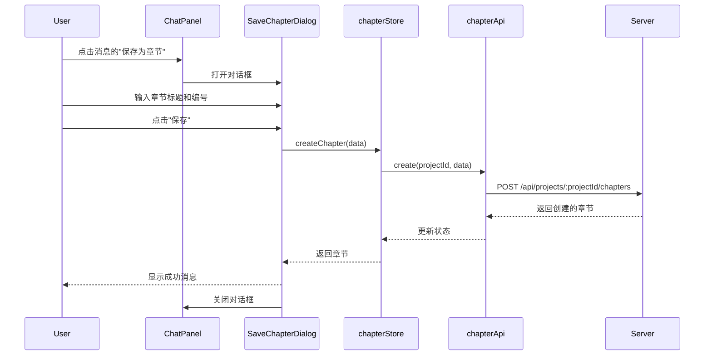
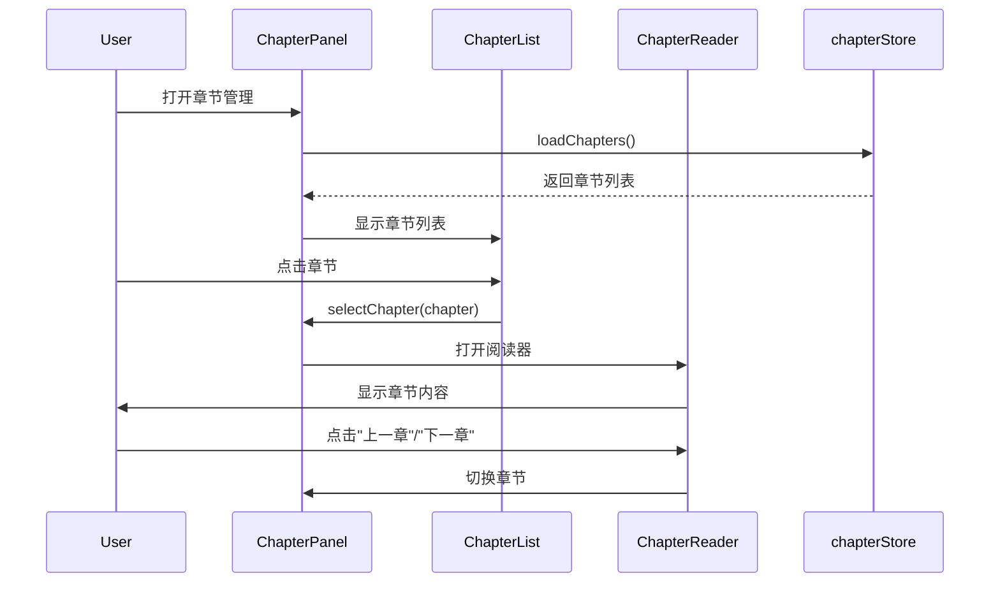
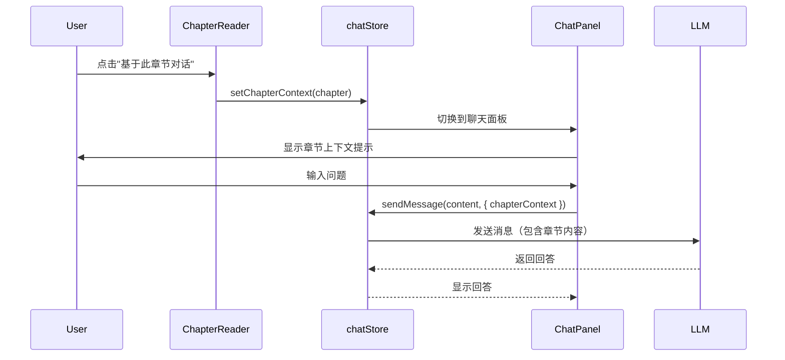
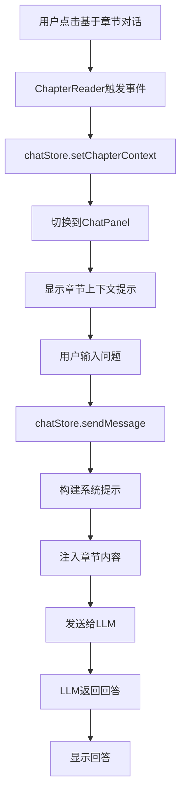

# 章节保存和阅读功能 - 架构设计方案

## 1. 数据库设计

### 1.1 chapters表结构

```sql
CREATE TABLE IF NOT EXISTS chapters (
  id TEXT PRIMARY KEY,
  project_id TEXT NOT NULL,
  chapter_number INTEGER NOT NULL,
  title TEXT NOT NULL,
  content TEXT NOT NULL,
  source_message_id TEXT,
  created_at INTEGER NOT NULL,
  updated_at INTEGER NOT NULL,
  deleted INTEGER NOT NULL DEFAULT 0,
  deleted_at INTEGER DEFAULT NULL,
  FOREIGN KEY (project_id) REFERENCES projects(id) ON DELETE CASCADE,
  FOREIGN KEY (source_message_id) REFERENCES messages(id) ON DELETE SET NULL
);

CREATE INDEX IF NOT EXISTS idx_chapters_project_id ON chapters(project_id);
CREATE INDEX IF NOT EXISTS idx_chapters_deleted ON chapters(deleted);
CREATE INDEX IF NOT EXISTS idx_chapters_deleted_at ON chapters(deleted_at);
CREATE INDEX IF NOT EXISTS idx_chapters_number ON chapters(chapter_number);
```

### 1.2 表字段说明

| 字段名 | 类型 | 约束 | 说明 |
|--------|------|------|------|
| id | TEXT | PRIMARY KEY | 章节唯一标识符（UUID） |
| project_id | TEXT | NOT NULL, FOREIGN KEY | 所属项目ID，关联projects表 |
| chapter_number | INTEGER | NOT NULL | 章节编号，用于排序（从1开始） |
| title | TEXT | NOT NULL | 章节标题 |
| content | TEXT | NOT NULL | 章节内容（富文本或纯文本） |
| source_message_id | TEXT | FOREIGN KEY | 来源消息ID，关联messages表（可为空） |
| created_at | INTEGER | NOT NULL | 创建时间戳（秒级Unix时间戳） |
| updated_at | INTEGER | NOT NULL | 更新时间戳（秒级Unix时间戳） |
| deleted | INTEGER | NOT NULL DEFAULT 0 | 软删除标记（0: 未删除, 1: 已删除） |
| deleted_at | INTEGER | DEFAULT NULL | 删除时间戳（秒级Unix时间戳，可选） |

### 1.3 设计决策

1. **软删除机制**：采用与timeline_nodes和characters表一致的软删除机制，支持恢复和永久删除
2. **章节编号**：使用chapter_number字段进行排序，允许用户自定义章节顺序
3. **来源追踪**：source_message_id字段记录章节来源的消息，便于追溯
4. **外键约束**：project_id使用CASCADE删除，source_message_id使用SET NULL，确保数据一致性

## 2. API接口设计

### 2.1 章节管理API

#### 获取章节列表
```
GET /api/projects/:projectId/chapters
```

**查询参数**：
- `deleted` (可选): "true" | "false" - 是否只返回已删除的章节

**响应格式**：
```json
{
  "data": [
    {
      "id": "uuid",
      "projectId": "uuid",
      "chapterNumber": 1,
      "title": "第一章：开篇",
      "content": "章节内容...",
      "sourceMessageId": "uuid",
      "createdAt": 1234567890,
      "updatedAt": 1234567890,
      "deleted": false,
      "deletedAt": null
    }
  ]
}
```

#### 获取单个章节
```
GET /api/projects/:projectId/chapters/:chapterId
```

**响应格式**：
```json
{
  "data": {
    "id": "uuid",
    "projectId": "uuid",
    "chapterNumber": 1,
    "title": "第一章：开篇",
    "content": "章节内容...",
    "sourceMessageId": "uuid",
    "createdAt": 1234567890,
    "updatedAt": 1234567890,
    "deleted": false,
    "deletedAt": null
  }
}
```

#### 创建章节
```
POST /api/projects/:projectId/chapters
```

**请求体**：
```json
{
  "title": "第一章：开篇",
  "content": "章节内容...",
  "sourceMessageId": "uuid",
  "chapterNumber": 1
}
```

**响应格式**：
```json
{
  "data": {
    "id": "uuid",
    "projectId": "uuid",
    "chapterNumber": 1,
    "title": "第一章：开篇",
    "content": "章节内容...",
    "sourceMessageId": "uuid",
    "createdAt": 1234567890,
    "updatedAt": 1234567890,
    "deleted": false,
    "deletedAt": null
  }
}
```

#### 更新章节（仅标题和排序）
```
PUT /api/projects/:projectId/chapters/:chapterId
```

**请求体**：
```json
{
  "title": "第一章：开篇（修订版）",
  "chapterNumber": 2
}
```

**响应格式**：
```json
{
  "data": {
    "id": "uuid",
    "projectId": "uuid",
    "chapterNumber": 2,
    "title": "第一章：开篇（修订版）",
    "content": "章节内容...",
    "sourceMessageId": "uuid",
    "createdAt": 1234567890,
    "updatedAt": 1234567900,
    "deleted": false,
    "deletedAt": null
  }
}
```

#### 删除章节（软删除）
```
DELETE /api/projects/:projectId/chapters/:chapterId
```

**响应格式**：
```json
{
  "success": true,
  "message": "章节已删除"
}
```

#### 更新章节排序
```
PUT /api/projects/:projectId/chapters/:chapterId/order
```

**请求体**：
```json
{
  "chapterNumber": 3
}
```

**响应格式**：
```json
{
  "data": {
    "id": "uuid",
    "projectId": "uuid",
    "chapterNumber": 3,
    "title": "第一章：开篇",
    "content": "章节内容...",
    "sourceMessageId": "uuid",
    "createdAt": 1234567890,
    "updatedAt": 1234567900,
    "deleted": false,
    "deletedAt": null
  }
}
```

#### 导出所有章节为txt
```
GET /api/projects/:projectId/chapters/export
```

**查询参数**：
- `format` (可选): "txt" | "md" - 导出格式，默认为"txt"

**响应格式**：
```json
{
  "content": "导出的文本内容...",
  "contentType": "text/plain",
  "filename": "项目名称.txt",
  "size": 12345
}
```

### 2.2 回收站API

#### 获取回收站章节列表
```
GET /api/projects/:projectId/chapters/trash
```

**响应格式**：
```json
{
  "data": [
    {
      "id": "uuid",
      "projectId": "uuid",
      "chapterNumber": 1,
      "title": "已删除的章节",
      "content": "章节内容...",
      "sourceMessageId": "uuid",
      "createdAt": 1234567890,
      "updatedAt": 1234567890,
      "deleted": true,
      "deletedAt": 1234567900
    }
  ]
}
```

#### 恢复章节
```
POST /api/projects/:projectId/chapters/:chapterId/restore
```

**响应格式**：
```json
{
  "success": true,
  "message": "章节已恢复"
}
```

#### 永久删除章节
```
DELETE /api/projects/:projectId/chapters/:chapterId/permanent
```

**响应格式**：
```json
{
  "success": true,
  "message": "章节已永久删除"
}
```

## 3. 前端组件设计

### 3.1 组件层次结构

```
MainLayout.vue
├── ChapterPanel.vue (新增)
│   ├── ChapterList.vue (新增)
│   │   └── ChapterItem.vue (新增)
│   └── ChapterReader.vue (新增)
│       ├── ChapterContent.vue (新增)
│       └── ChapterNavigation.vue (新增)
└── ChatPanel.vue (修改)
    └── 添加"保存为章节"按钮
```

### 3.2 组件详细设计

#### 3.2.1 ChapterPanel.vue

**功能**：章节管理主面板，包含章节列表和阅读器

**Props**：无

**State**：
- `chapters`: Chapter[] - 章节列表
- `selectedChapter`: Chapter | null - 当前选中的章节
- `isReading`: boolean - 是否处于阅读模式
- `isLoading`: boolean - 加载状态
- `isTrashMode`: boolean - 是否显示回收站

**主要方法**：
- `loadChapters()` - 加载章节列表
- `selectChapter(chapter: Chapter)` - 选择章节
- `createChapter(data: CreateChapterRequest)` - 创建章节
- `updateChapter(id: string, data: UpdateChapterRequest)` - 更新章节
- `deleteChapter(id: string)` - 删除章节
- `updateChapterOrder(id: string, chapterNumber: number)` - 更新章节排序
- `exportChapters(format: 'txt' | 'md')` - 导出章节
- `toggleTrashMode()` - 切换回收站模式
- `restoreChapter(id: string)` - 恢复章节
- `permanentDeleteChapter(id: string)` - 永久删除章节

**UI结构**：
```vue
<template>
  <el-container class="chapter-panel">
    <el-header class="chapter-header">
      <span class="panel-title">章节管理</span>
      <div class="header-controls">
        <el-button @click="handleCreateChapter">新建章节</el-button>
        <el-button @click="handleExport">导出</el-button>
        <el-button @click="toggleTrashMode">
          {{ isTrashMode ? '返回列表' : '回收站' }}
        </el-button>
      </div>
    </el-header>

    <el-container v-if="!isReading" class="chapter-list-container">
      <ChapterList
        :chapters="chapters"
        :is-trash-mode="isTrashMode"
        @select="selectChapter"
        @delete="deleteChapter"
        @restore="restoreChapter"
        @permanent-delete="permanentDeleteChapter"
        @update-order="updateChapterOrder"
      />
    </el-container>

    <ChapterReader
      v-else
      :chapter="selectedChapter"
      :chapters="chapters"
      @close="closeReader"
      @chat-with-chapter="handleChatWithChapter"
    />
  </el-container>
</template>
```

#### 3.2.2 ChapterList.vue

**功能**：章节列表组件，显示所有章节

**Props**：
- `chapters`: Chapter[] - 章节列表
- `isTrashMode`: boolean - 是否为回收站模式

**Emits**：
- `select(chapter: Chapter)` - 选择章节
- `delete(id: string)` - 删除章节
- `restore(id: string)` - 恢复章节
- `permanent-delete(id: string)` - 永久删除章节
- `update-order(id: string, chapterNumber: number)` - 更新排序

**UI结构**：
```vue
<template>
  <div class="chapter-list">
    <div
      v-for="chapter in sortedChapters"
      :key="chapter.id"
      class="chapter-item"
      @click="$emit('select', chapter)"
    >
      <div class="chapter-number">第{{ chapter.chapterNumber }}章</div>
      <div class="chapter-title">{{ chapter.title }}</div>
      <div class="chapter-preview">{{ chapter.content.slice(0, 100) }}...</div>
      <div class="chapter-actions">
        <el-dropdown @command="(cmd) => handleCommand(cmd, chapter.id)">
          <el-button :icon="MoreFilled" circle size="small" text />
          <template #dropdown>
            <el-dropdown-menu>
              <el-dropdown-item v-if="!isTrashMode" command="delete">删除</el-dropdown-item>
              <el-dropdown-item v-if="!isTrashMode" command="order">调整排序</el-dropdown-item>
              <el-dropdown-item v-if="isTrashMode" command="restore">恢复</el-dropdown-item>
              <el-dropdown-item v-if="isTrashMode" command="permanent-delete">永久删除</el-dropdown-item>
            </el-dropdown-menu>
          </template>
        </el-dropdown>
      </div>
    </div>
  </div>
</template>
```

#### 3.2.3 ChapterReader.vue

**功能**：章节阅读器，类似电子书阅读器

**Props**：
- `chapter`: Chapter - 当前阅读的章节
- `chapters`: Chapter[] - 所有章节列表（用于导航）

**Emits**：
- `close()` - 关闭阅读器
- `chat-with-chapter(chapter: Chapter)` - 基于章节进行对话

**State**：
- `fontSize`: number - 字体大小
- `lineHeight`: number - 行高
- `theme`: 'light' | 'dark' - 主题

**UI结构**：
```vue
<template>
  <el-container class="chapter-reader">
    <el-header class="reader-header">
      <el-button @click="$emit('close')">返回</el-button>
      <span class="chapter-title">{{ chapter.title }}</span>
      <div class="reader-controls">
        <el-button @click="decreaseFontSize">A-</el-button>
        <el-button @click="increaseFontSize">A+</el-button>
        <el-button @click="toggleTheme">主题</el-button>
      </div>
    </el-header>

    <el-main class="reader-content">
      <div class="chapter-number">第{{ chapter.chapterNumber }}章</div>
      <div class="chapter-text" :style="readerStyles">
        {{ chapter.content }}
      </div>
    </el-main>

    <el-footer class="reader-footer">
      <ChapterNavigation
        :current-chapter="chapter"
        :chapters="chapters"
        @prev="handlePrevChapter"
        @next="handleNextChapter"
      />
      <el-button type="primary" @click="handleChatWithChapter">
        基于此章节对话
      </el-button>
    </el-footer>
  </el-container>
</template>
```

#### 3.2.4 ChapterNavigation.vue

**功能**：章节导航组件，上一章/下一章

**Props**：
- `currentChapter`: Chapter - 当前章节
- `chapters`: Chapter[] - 所有章节列表

**Emits**：
- `prev()` - 上一章
- `next()` - 下一章

**UI结构**：
```vue
<template>
  <div class="chapter-navigation">
    <el-button
      :disabled="!hasPrevChapter"
      @click="$emit('prev')"
    >
      上一章
    </el-button>
    <span class="chapter-indicator">
      {{ currentChapter.chapterNumber }} / {{ chapters.length }}
    </span>
    <el-button
      :disabled="!hasNextChapter"
      @click="$emit('next')"
    >
      下一章
    </el-button>
  </div>
</template>
```

#### 3.2.5 ChatPanel.vue 修改

**修改内容**：
- 在消息卡片中添加"保存为章节"按钮
- 在消息下拉菜单中添加"保存为章节"选项

**修改位置**：
```vue
<!-- 在消息卡片中添加 -->
<el-dropdown-item command="save-as-chapter">保存为章节</el-dropdown-item>

<!-- 在脚本中添加处理函数 -->
const handleMessageCommand = async (command: string, messageId: string) => {
  if (command === 'save-as-chapter' && messageId) {
    await handleSaveAsChapter(messageId);
  }
  // ... 其他命令处理
};

const handleSaveAsChapter = async (messageId: string) => {
  const message = messages.value.find(m => m.id === messageId);
  if (!message || message.role !== 'assistant') {
    ElMessage.warning('只能保存AI助手的回答为章节');
    return;
  }

  try {
    // 打开创建章节对话框
    showSaveChapterDialog.value = true;
    selectedMessageForChapter.value = message;
  } catch (error) {
    console.error('Failed to save as chapter:', error);
  }
};
```

#### 3.2.6 MainLayout.vue 修改

**修改内容**：
- 在主布局中添加"章节管理"入口

**修改位置**：
```vue
<!-- 在内容容器中添加章节面板 -->
<el-container class="content-container">
  <TimelinePanel />
  <ChatPanel />
  <CharacterPanel />
  <ChapterPanel /> <!-- 新增 -->
</el-container>

<!-- 或者在菜单中添加章节管理入口 -->
<el-dropdown-item command="chapters">章节管理</el-dropdown-item>
```

### 3.3 交互流程

#### 3.3.1 保存消息为章节流程



#### 3.3.2 阅读章节流程



#### 3.3.3 基于章节对话流程



## 4. 状态管理设计

### 4.1 chapterStore.ts

```typescript
import { defineStore } from 'pinia';
import { ref, computed } from 'vue';
import type { Chapter } from '@shared/types';
import { chapterApi } from '../utils/api';
import { useProjectStore } from './projectStore';

export const useChapterStore = defineStore('chapter', () => {
  // State
  const chapters = ref<Chapter[]>([]);
  const currentChapter = ref<Chapter | null>(null);
  const isLoading = ref(false);
  const isTrashMode = ref(false);

  // Computed
  const activeChapters = computed(() => 
    chapters.value.filter(c => !c.deleted)
  );

  const deletedChapters = computed(() => 
    chapters.value.filter(c => c.deleted)
  );

  const sortedChapters = computed(() => {
    const list = isTrashMode.value ? deletedChapters.value : activeChapters.value;
    return [...list].sort((a, b) => a.chapterNumber - b.chapterNumber);
  });

  // Actions
  const loadChapters = async (projectId: string, deleted?: boolean) => {
    const projectStore = useProjectStore();
    if (!projectStore.currentProject) {
      throw new Error('未选择项目');
    }

    try {
      isLoading.value = true;
      const response = await chapterApi.list(projectId, { deleted });
      chapters.value = response.data;
    } catch (error) {
      console.error('加载章节失败:', error);
      throw error;
    } finally {
      isLoading.value = false;
    }
  };

  const getChapter = async (chapterId: string) => {
    try {
      const response = await chapterApi.get(chapterId);
      return response.data;
    } catch (error) {
      console.error('获取章节失败:', error);
      throw error;
    }
  };

  const createChapter = async (data: {
    title: string;
    content: string;
    sourceMessageId?: string;
    chapterNumber?: number;
  }) => {
    const projectStore = useProjectStore();
    if (!projectStore.currentProject) {
      throw new Error('未选择项目');
    }

    try {
      isLoading.value = true;
      const response = await chapterApi.create(
        projectStore.currentProject.id,
        data
      );
      chapters.value.unshift(response.data);
      return response.data;
    } catch (error) {
      console.error('创建章节失败:', error);
      throw error;
    } finally {
      isLoading.value = false;
    }
  };

  const updateChapter = async (
    chapterId: string,
    data: {
      title?: string;
      chapterNumber?: number;
    }
  ) => {
    try {
      isLoading.value = true;
      const response = await chapterApi.update(chapterId, data);
      const index = chapters.value.findIndex(c => c.id === chapterId);
      if (index !== -1) {
        chapters.value[index] = response.data;
      }
      return response.data;
    } catch (error) {
      console.error('更新章节失败:', error);
      throw error;
    } finally {
      isLoading.value = false;
    }
  };

  const deleteChapter = async (chapterId: string) => {
    try {
      await chapterApi.delete(chapterId);
      const index = chapters.value.findIndex(c => c.id === chapterId);
      if (index !== -1) {
        chapters.value[index] = {
          ...chapters.value[index],
          deleted: true,
          deletedAt: Date.now(),
        };
      }
    } catch (error) {
      console.error('删除章节失败:', error);
      throw error;
    }
  };

  const updateChapterOrder = async (
    chapterId: string,
    chapterNumber: number
  ) => {
    try {
      const response = await chapterApi.updateOrder(chapterId, { chapterNumber });
      const index = chapters.value.findIndex(c => c.id === chapterId);
      if (index !== -1) {
        chapters.value[index] = response.data;
      }
    } catch (error) {
      console.error('更新章节排序失败:', error);
      throw error;
    }
  };

  const exportChapters = async (format: 'txt' | 'md' = 'txt') => {
    const projectStore = useProjectStore();
    if (!projectStore.currentProject) {
      throw new Error('未选择项目');
    }

    try {
      const response = await chapterApi.export(
        projectStore.currentProject.id,
        format
      );
      return response.data;
    } catch (error) {
      console.error('导出章节失败:', error);
      throw error;
    }
  };

  const restoreChapter = async (chapterId: string) => {
    try {
      await chapterApi.restore(chapterId);
      const index = chapters.value.findIndex(c => c.id === chapterId);
      if (index !== -1) {
        chapters.value[index] = {
          ...chapters.value[index],
          deleted: false,
          deletedAt: undefined,
        };
      }
    } catch (error) {
      console.error('恢复章节失败:', error);
      throw error;
    }
  };

  const permanentDeleteChapter = async (chapterId: string) => {
    try {
      await chapterApi.permanentDelete(chapterId);
      chapters.value = chapters.value.filter(c => c.id !== chapterId);
    } catch (error) {
      console.error('永久删除章节失败:', error);
      throw error;
    }
  };

  const toggleTrashMode = () => {
    isTrashMode.value = !isTrashMode.value;
  };

  const selectChapter = (chapter: Chapter) => {
    currentChapter.value = chapter;
  };

  const clearCurrentChapter = () => {
    currentChapter.value = null;
  };

  return {
    // State
    chapters,
    currentChapter,
    isLoading,
    isTrashMode,

    // Computed
    activeChapters,
    deletedChapters,
    sortedChapters,

    // Actions
    loadChapters,
    getChapter,
    createChapter,
    updateChapter,
    deleteChapter,
    updateChapterOrder,
    exportChapters,
    restoreChapter,
    permanentDeleteChapter,
    toggleTrashMode,
    selectChapter,
    clearCurrentChapter,
  };
});
```

### 4.2 chatStore.ts 修改

**修改内容**：
- 添加章节上下文状态
- 修改sendMessage方法，支持章节上下文

```typescript
// 在chatStore中添加
const chapterContext = ref<Chapter | null>(null);

const setChapterContext = (chapter: Chapter) => {
  chapterContext.value = chapter;
};

const clearChapterContext = () => {
  chapterContext.value = null;
};

// 修改sendMessage方法，在构建系统提示时包含章节内容
const sendMessage = async (content: string, options: ChatOptions = {}) => {
  // ... 现有代码

  let systemPrompt = buildSystemPrompt(
    options.systemPrompt,
    [],
    [],
    ALL_TOOLS
  );

  // 如果有章节上下文，添加到系统提示
  if (chapterContext.value) {
    systemPrompt += `\n\n当前阅读的章节：\n第${chapterContext.value.chapterNumber}章 ${chapterContext.value.title}\n\n${chapterContext.value.content}`;
  }

  // ... 继续处理
};
```

## 5. LLM集成设计

### 5.1 章节上下文传递机制

#### 5.1.1 上下文注入方式

**方案1：作为系统提示的一部分**
- 优点：简单直接，LLM能明确知道这是上下文
- 缺点：占用token较多

**方案2：作为第一条用户消息**
- 优点：更自然，模拟真实对话
- 缺点：可能被LLM误解为用户输入

**推荐方案1**：将章节内容作为系统提示的一部分，使用清晰的格式标记。

#### 5.1.2 系统提示格式

```
你是一个专业的小说写作助手。

当前阅读的章节：
第1章 开篇

章节内容：
（这里放置章节的完整内容）

请基于以上章节内容回答用户的问题。
```

#### 5.1.3 实现流程



### 5.2 Token管理

#### 5.2.1 章节内容截断

章节内容可能很长，需要根据LLM的token限制进行截断：

```typescript
const truncateChapterContent = (
  content: string,
  maxTokens: number,
  model: string
): string => {
  const estimatedTokens = estimateTokens(content);
  
  if (estimatedTokens <= maxTokens) {
    return content;
  }

  // 按比例截断
  const ratio = maxTokens / estimatedTokens;
  const truncatedLength = Math.floor(content.length * ratio);
  
  return content.slice(0, truncatedLength) + '\n\n...（内容已截断）';
};
```

#### 5.2.2 Token估算

使用现有的`estimateConversationTokens`函数，添加章节内容的token估算：

```typescript
const updateTokenCount = () => {
  const messagesForTokens = messages.value.map(m => ({
    role: m.role,
    content: m.content,
  }));

  // 添加章节上下文的token估算
  if (chapterContext.value) {
    const chapterTokens = estimateTokens(chapterContext.value.content);
    totalTokens.value = estimateConversationTokens(messagesForTokens) + chapterTokens;
  } else {
    totalTokens.value = estimateConversationTokens(messagesForTokens);
  }
};
```

### 5.3 用户体验优化

#### 5.3.1 章节上下文提示

在ChatPanel中显示当前使用的章节上下文：

```vue
<el-alert
  v-if="chapterContext"
  type="info"
  :closable="true"
  @close="clearChapterContext"
>
  <template #title>
    当前基于：第{{ chapterContext.chapterNumber }}章 {{ chapterContext.title }}
  </template>
</el-alert>
```

#### 5.3.2 清除上下文

提供清除章节上下文的按钮，允许用户返回正常对话模式：

```typescript
const clearChapterContext = () => {
  chatStore.clearChapterContext();
  ElMessage.success('已清除章节上下文');
};
```

## 6. 类型定义

### 6.1 src/shared/types.ts 新增类型

```typescript
/**
 * 章节接口
 * 表示小说中的一个章节
 */
export interface Chapter {
  /** 章节唯一标识符（UUID） */
  id: string;
  
  /** 所属项目的 ID */
  projectId: string;
  
  /** 章节编号（用于排序） */
  chapterNumber: number;
  
  /** 章节标题 */
  title: string;
  
  /** 章节内容 */
  content: string;
  
  /** 来源消息 ID（关联到 messages 表） */
  sourceMessageId?: string;
  
  /** 章节创建时间戳（秒） */
  createdAt: number;
  
  /** 章节最后更新时间戳（秒） */
  updatedAt: number;
  
  /** 是否已删除（软删除标记） */
  deleted?: boolean;
  
  /** 删除时间戳（秒，可选） */
  deletedAt?: number;
}

/**
 * 数据库章节接口
 * 使用 snake_case 字段名，表示数据库中的原始数据
 */
export interface DbChapter {
  id: string;
  project_id: string;
  chapter_number: number;
  title: string;
  content: string;
  source_message_id: string | null;
  created_at: number;
  updated_at: number;
  deleted: number;
  deleted_at: number | null;
}

/**
 * 创建章节请求接口
 */
export interface CreateChapterRequest {
  title: string;
  content: string;
  sourceMessageId?: string;
  chapterNumber?: number;
}

/**
 * 更新章节请求接口
 */
export interface UpdateChapterRequest {
  title?: string;
  chapterNumber?: number;
}

/**
 * 更新章节排序请求接口
 */
export interface UpdateChapterOrderRequest {
  chapterNumber: number;
}

/**
 * 导出章节响应接口
 */
export interface ExportChaptersResponse {
  content: string;
  contentType: string;
  filename: string;
  size: number;
}
```

### 6.2 src/server/types/service.types.ts 新增类型

```typescript
/**
 * 章节服务相关类型
 */

/**
 * 创建章节选项
 */
export interface CreateChapterOptions {
  projectId: string;
  title: string;
  content: string;
  sourceMessageId?: string;
  chapterNumber?: number;
}

/**
 * 更新章节选项
 */
export interface UpdateChapterOptions {
  title?: string;
  chapterNumber?: number;
}

/**
 * 更新章节排序选项
 */
export interface UpdateChapterOrderOptions {
  chapterNumber: number;
}

/**
 * 导出章节选项
 */
export interface ExportChaptersOptions {
  projectId: string;
  format: 'txt' | 'md';
}
```

## 7. 导出服务设计

### 7.1 扩展 exportService.ts

```typescript
/**
 * 导出章节为文本或Markdown格式
 * @param projectId - 项目 ID
 * @param format - 导出格式（md 或 txt）
 * @returns 包含 content 字段的对象
 * @throws {Error} 当项目不存在时抛出错误
 */
export function exportChapters(projectId: string, format: 'md' | 'txt'): ExportResult {
  const projects = query<DbProject>('SELECT * FROM projects WHERE id = ?', [projectId]);
  const project = projects[0];

  if (!project) {
    throw new Error('项目不存在');
  }

  const chapters = query<DbChapter>(
    'SELECT * FROM chapters WHERE project_id = ? AND deleted = 0 ORDER BY chapter_number ASC',
    [projectId]
  );

  let content = '';

  if (format === 'md') {
    content = exportChaptersMarkdown(project, chapters);
  } else {
    content = exportChaptersText(project, chapters);
  }

  return {
    content,
    contentType: format === 'md' ? 'text/markdown' : 'text/plain',
    filename: `${project.name}_chapters.${format}`,
    size: Buffer.byteLength(content, 'utf-8')
  };
}

/**
 * 导出章节为 Markdown 格式
 * @param project - 项目对象
 * @param chapters - 章节数组
 * @returns Markdown 格式的导出内容
 */
function exportChaptersMarkdown(
  project: DbProject,
  chapters: DbChapter[]
): string {
  let content = '';

  content += `# ${project.name} - 章节合集\n\n`;
  if (project.description) {
    content += `${project.description}\n\n`;
  }

  content += `---\n\n`;

  for (const chapter of chapters) {
    content += `## 第${chapter.chapter_number}章 ${chapter.title}\n\n`;
    content += `${chapter.content}\n\n`;
    content += `---\n\n`;
  }

  return content;
}

/**
 * 导出章节为纯文本格式
 * @param project - 项目对象
 * @param chapters - 章节数组
 * @returns 纯文本格式的导出内容
 */
function exportChaptersText(
  project: DbProject,
  chapters: DbChapter[]
): string {
  let content = '';

  content += `${project.name}\n${'='.repeat(project.name.length)}\n\n`;
  if (project.description) {
    content += `${project.description}\n\n`;
  }

  content += `章节合集\n${'-'.repeat(20)}\n\n`;

  for (const chapter of chapters) {
    content += `第${chapter.chapter_number}章 ${chapter.title}\n`;
    content += `${'.'.repeat(`第${chapter.chapter_number}章 ${chapter.title}`.length)}\n\n`;
    content += `${chapter.content}\n\n`;
    content += `${'-'.repeat(20)}\n\n`;
  }

  return content;
}
```

### 7.2 导出格式示例

#### 7.2.1 TXT格式

```
我的小说
=======

这是一个关于冒险的故事。

章节合集
--------------------

第1章 开篇
.........

这是第一章的内容，讲述了主角的诞生。

--------------------

第2章 冒险开始
...........

这是第二章的内容，主角踏上了冒险之旅。

--------------------
```

#### 7.2.2 Markdown格式

```markdown
# 我的小说 - 章节合集

这是一个关于冒险的故事。

---

## 第1章 开篇

这是第一章的内容，讲述了主角的诞生。

---

## 第2章 冒险开始

这是第二章的内容，主角踏上了冒险之旅。

---
```

## 8. 实现步骤建议

### 8.1 后端实现

1. **数据库迁移**
   - 在 `src/server/db/schema.ts` 中添加chapters表的创建语句
   - 在 `src/server/db/schema.ts` 中添加chapters表的索引
   - 在 `src/server/db/schema.ts` 的 `getMigrationSQLs()` 中添加迁移语句（如果需要）

2. **类型定义**
   - 在 `src/shared/types.ts` 中添加Chapter相关类型
   - 在 `src/server/types/service.types.ts` 中添加章节服务相关类型

3. **路由实现**
   - 创建 `src/server/routes/chapters.ts`
   - 实现所有章节相关的API端点

4. **服务实现**
   - 在 `src/server/services/exportService.ts` 中添加章节导出功能
   - 创建 `src/server/services/chapterService.ts`（可选，用于封装业务逻辑）

5. **服务器集成**
   - 在 `src/server/index.ts` 中注册章节路由

### 8.2 前端实现

1. **API层**
   - 在 `src/renderer/utils/api.ts` 中添加 `chapterApi`

2. **状态管理**
   - 创建 `src/renderer/stores/chapterStore.ts`

3. **组件实现**
   - 创建 `src/renderer/components/ChapterPanel.vue`
   - 创建 `src/renderer/components/ChapterList.vue`
   - 创建 `src/renderer/components/ChapterReader.vue`
   - 创建 `src/renderer/components/ChapterNavigation.vue`
   - 创建 `src/renderer/components/SaveChapterDialog.vue`

4. **组件集成**
   - 修改 `src/renderer/components/ChatPanel.vue`，添加"保存为章节"功能
   - 修改 `src/renderer/components/MainLayout.vue`，添加章节管理入口

5. **样式调整**
   - 为新组件添加样式，保持与现有组件一致的设计风格

### 8.3 测试建议

1. **单元测试**
   - 测试章节CRUD操作
   - 测试章节排序功能
   - 测试软删除和恢复功能
   - 测试导出功能

2. **集成测试**
   - 测试从聊天消息保存为章节的完整流程
   - 测试章节阅读和导航功能
   - 测试基于章节对话的功能

3. **用户体验测试**
   - 测试章节列表的响应速度
   - 测试大章节内容的渲染性能
   - 测试移动端适配（如果需要）

### 8.4 性能优化建议

1. **数据库优化**
   - 为常用查询字段添加索引
   - 考虑使用分页查询章节列表（如果章节数量很多）

2. **前端优化**
   - 使用虚拟滚动优化章节列表渲染
   - 对章节内容进行懒加载
   - 缓存已加载的章节内容

3. **LLM集成优化**
   - 实现章节内容的智能截断
   - 添加token使用量的实时显示
   - 提供章节内容摘要选项

## 9. 数据流图

### 9.1 章节保存数据流


### 9.2 章节阅读数据流


### 9.3 基于章节对话数据流


## 10. 安全性考虑

### 10.1 数据验证

1. **输入验证**
   - 验证章节标题不为空
   - 验证章节编号为正整数
   - 验证章节内容不为空

2. **权限验证**
   - 确保用户只能操作自己项目的章节
   - 验证章节所属项目ID与当前项目一致

### 10.2 XSS防护

1. **内容转义**
   - 在渲染章节内容时进行HTML转义
   - 使用marked库的选项进行安全配置

2. **CSP策略**
   - 配置内容安全策略，防止XSS攻击

### 10.3 SQL注入防护

1. **参数化查询**
   - 所有数据库查询使用参数化查询
   - 避免直接拼接SQL字符串

## 11. 可扩展性考虑

### 11.1 未来功能扩展

1. **章节版本管理**
   - 参考timeline_nodes和characters的版本管理
   - 支持章节的历史版本查看和恢复

2. **章节标签和分类**
   - 添加tags字段支持章节标签
   - 支持按标签筛选章节

3. **章节评论和批注**
   - 添加章节评论功能
   - 支持在章节内容中添加批注

4. **多人协作**
   - 支持多用户同时编辑章节
   - 添加章节锁定机制

### 11.2 技术扩展

1. **富文本编辑**
   - 集成富文本编辑器（如Quill、TinyMCE）
   - 支持章节内容的格式化编辑

2. **章节导出扩展**
   - 支持导出为PDF
   - 支持导出为EPUB格式

3. **AI辅助**
   - 使用AI自动生成章节摘要
   - 使用AI进行章节内容优化建议

## 12. 总结

本架构设计方案为"章节保存和阅读功能"提供了完整的技术实现路径，包括：

1. **数据库设计**：采用软删除机制，支持章节排序和来源追踪
2. **API设计**：RESTful风格，支持完整的CRUD操作和导出功能
3. **前端组件**：模块化设计，包含章节列表、阅读器等核心组件
4. **状态管理**：使用Pinia进行统一的状态管理
5. **LLM集成**：支持将章节内容作为上下文发送给LLM
6. **类型定义**：完整的TypeScript类型系统
7. **导出服务**：支持TXT和Markdown格式导出

该方案遵循项目现有的代码规范，与现有系统无缝集成，同时考虑了性能优化、安全性和可扩展性。
