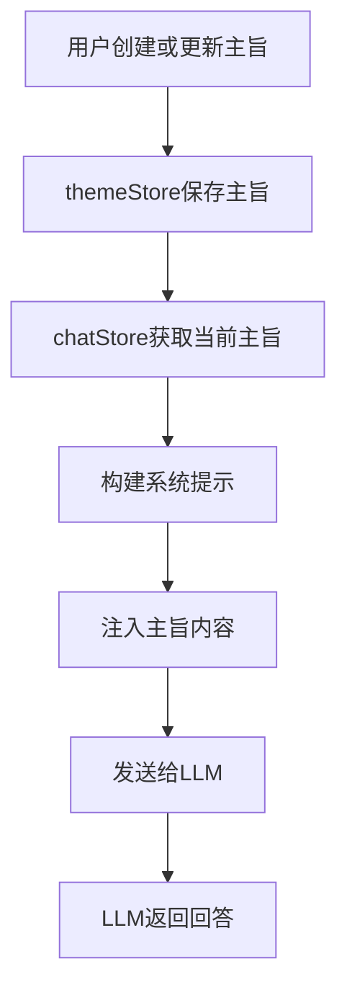
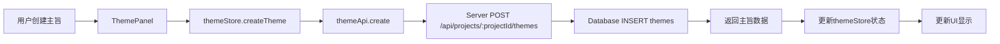
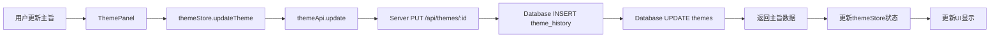
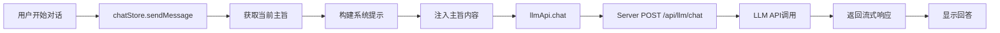

# 主旨注入功能 - 架构设计方案

## 1. 功能概述

主旨注入功能允许用户为小说项目定义和管理主旨信息，包括故事概述、小说类型、世界背景等。这些主旨信息将被注入到system prompt中，为LLM提供更准确的上下文指导。

## 2. 数据库设计

### 2.1 themes表结构

```sql
CREATE TABLE IF NOT EXISTS themes (
  id TEXT PRIMARY KEY,
  project_id TEXT NOT NULL,
  title TEXT NOT NULL,
  content TEXT NOT NULL,
  version INTEGER NOT NULL DEFAULT 1,
  created_by TEXT NOT NULL,
  created_at INTEGER NOT NULL,
  updated_at INTEGER NOT NULL,
  deleted INTEGER NOT NULL DEFAULT 0,
  deleted_at INTEGER DEFAULT NULL,
  FOREIGN KEY (project_id) REFERENCES projects(id) ON DELETE CASCADE
);

CREATE INDEX IF NOT EXISTS idx_themes_project_id ON themes(project_id);
CREATE INDEX IF NOT EXISTS idx_themes_deleted ON themes(deleted);
CREATE INDEX IF NOT EXISTS idx_themes_deleted_at ON themes(deleted_at);
CREATE INDEX IF NOT EXISTS idx_themes_project_deleted ON themes(project_id, deleted);
```

### 2.2 theme_history表结构

```sql
CREATE TABLE IF NOT EXISTS theme_history (
  id TEXT PRIMARY KEY,
  theme_id TEXT NOT NULL,
  content TEXT NOT NULL,
  version INTEGER NOT NULL,
  created_by TEXT NOT NULL,
  created_at INTEGER NOT NULL,
  FOREIGN KEY (theme_id) REFERENCES themes(id) ON DELETE CASCADE
);

CREATE INDEX IF NOT EXISTS idx_theme_history_theme_id ON theme_history(theme_id);
```

### 2.3 表字段说明

#### themes表

| 字段名 | 类型 | 约束 | 说明 |
|--------|------|------|------|
| id | TEXT | PRIMARY KEY | 主旨唯一标识符（UUID） |
| project_id | TEXT | NOT NULL, FOREIGN KEY | 所属项目ID，关联projects表 |
| title | TEXT | NOT NULL | 主旨标题 |
| content | TEXT | NOT NULL | 主旨内容（故事概述、类型、世界背景等） |
| version | INTEGER | NOT NULL DEFAULT 1 | 版本号（从1开始递增） |
| created_by | TEXT | NOT NULL | 创建者类型（user/llm） |
| created_at | INTEGER | NOT NULL | 创建时间戳（秒级Unix时间戳） |
| updated_at | INTEGER | NOT NULL | 更新时间戳（秒级Unix时间戳） |
| deleted | INTEGER | NOT NULL DEFAULT 0 | 软删除标记（0: 未删除, 1: 已删除） |
| deleted_at | INTEGER | DEFAULT NULL | 删除时间戳（秒级Unix时间戳，可选） |

#### theme_history表

| 字段名 | 类型 | 约束 | 说明 |
|--------|------|------|------|
| id | TEXT | PRIMARY KEY | 历史记录唯一标识符（UUID） |
| theme_id | TEXT | NOT NULL, FOREIGN KEY | 所属主旨ID，关联themes表 |
| content | TEXT | NOT NULL | 历史版本的主旨内容 |
| version | INTEGER | NOT NULL | 版本号（从1开始递增） |
| created_by | TEXT | NOT NULL | 创建者类型（user/llm） |
| created_at | INTEGER | NOT NULL | 历史记录创建时间戳（秒级Unix时间戳） |

### 2.4 设计决策

1. **软删除机制**：采用与chapters、timeline_nodes和characters表一致的软删除机制，支持恢复和永久删除
2. **版本管理**：使用version字段记录主旨版本，每次更新自动创建历史记录
3. **创建者追踪**：created_by字段记录主旨是由用户创建还是由LLM生成
4. **外键约束**：project_id使用CASCADE删除，theme_history使用CASCADE删除，确保数据一致性
5. **索引优化**：为常用查询字段添加索引，提高查询性能

## 3. API接口设计

### 3.1 主旨管理API

#### 获取项目的主旨列表

```
GET /api/projects/:projectId/themes
```

**路径参数**：
- `projectId` (必填): 项目ID（UUID格式）

**查询参数**：
- `deleted` (可选): "true" | "false" - 是否只返回已删除的主旨

**响应格式**：
```json
{
  "data": [
    {
      "id": "uuid",
      "projectId": "uuid",
      "title": "主旨标题",
      "content": "主旨内容...",
      "version": 1,
      "createdBy": "user",
      "createdAt": 1234567890,
      "updatedAt": 1234567890,
      "deleted": false,
      "deletedAt": null
    }
  ]
}
```

#### 获取当前主旨（最新版本）

```
GET /api/projects/:projectId/themes/current
```

**路径参数**：
- `projectId` (必填): 项目ID（UUID格式）

**响应格式**：
```json
{
  "data": {
    "id": "uuid",
    "projectId": "uuid",
    "title": "主旨标题",
    "content": "主旨内容...",
    "version": 1,
    "createdBy": "user",
    "createdAt": 1234567890,
    "updatedAt": 1234567890,
    "deleted": false,
    "deletedAt": null
  }
}
```

**错误响应**：
```json
{
  "error": "未找到主旨"
}
```

#### 创建新主旨

```
POST /api/projects/:projectId/themes
```

**路径参数**：
- `projectId` (必填): 项目ID（UUID格式）

**请求体**：
```json
{
  "title": "主旨标题",
  "content": "主旨内容..."
}
```

**响应格式**：
```json
{
  "data": {
    "id": "uuid",
    "projectId": "uuid",
    "title": "主旨标题",
    "content": "主旨内容...",
    "version": 1,
    "createdBy": "user",
    "createdAt": 1234567890,
    "updatedAt": 1234567890,
    "deleted": false,
    "deletedAt": null
  }
}
```

#### 更新主旨（自动创建历史记录）

```
PUT /api/themes/:id
```

**路径参数**：
- `id` (必填): 主旨ID（UUID格式）

**请求体**：
```json
{
  "title": "主旨标题（可选）",
  "content": "主旨内容（可选）"
}
```

**响应格式**：
```json
{
  "data": {
    "id": "uuid",
    "projectId": "uuid",
    "title": "主旨标题",
    "content": "主旨内容...",
    "version": 2,
    "createdBy": "user",
    "createdAt": 1234567890,
    "updatedAt": 1234567900,
    "deleted": false,
    "deletedAt": null
  }
}
```

**说明**：
- 更新主旨时，自动将旧版本保存到theme_history表
- version字段自动递增
- updated_at字段更新为当前时间

#### 删除主旨（软删除）

```
DELETE /api/themes/:id
```

**路径参数**：
- `id` (必填): 主旨ID（UUID格式）

**响应格式**：
```json
{
  "success": true,
  "message": "主旨已删除"
}
```

#### 获取主旨的历史记录

```
GET /api/themes/:id/history
```

**路径参数**：
- `id` (必填): 主旨ID（UUID格式）

**响应格式**：
```json
{
  "data": [
    {
      "id": "uuid",
      "themeId": "uuid",
      "content": "主旨内容...",
      "version": 1,
      "createdBy": "user",
      "createdAt": 1234567890
    },
    {
      "id": "uuid",
      "themeId": "uuid",
      "content": "主旨内容...",
      "version": 2,
      "createdBy": "user",
      "createdAt": 1234567900
    }
  ]
}
```

#### 获取指定版本的历史记录

```
GET /api/themes/:id/history/:version
```

**路径参数**：
- `id` (必填): 主旨ID（UUID格式）
- `version` (必填): 版本号

**响应格式**：
```json
{
  "data": {
    "id": "uuid",
    "themeId": "uuid",
    "content": "主旨内容...",
    "version": 2,
    "createdBy": "user",
    "createdAt": 1234567900
  }
}
```

**错误响应**：
```json
{
  "error": "未找到指定版本的主旨"
}
```

### 3.2 回收站API

#### 获取回收站主旨列表

```
GET /api/projects/:projectId/themes/trash
```

**路径参数**：
- `projectId` (必填): 项目ID（UUID格式）

**响应格式**：
```json
{
  "data": [
    {
      "id": "uuid",
      "projectId": "uuid",
      "title": "已删除的主旨",
      "content": "主旨内容...",
      "version": 1,
      "createdBy": "user",
      "createdAt": 1234567890,
      "updatedAt": 1234567890,
      "deleted": true,
      "deletedAt": 1234567900
    }
  ]
}
```

#### 恢复主旨

```
POST /api/themes/:id/restore
```

**路径参数**：
- `id` (必填): 主旨ID（UUID格式）

**响应格式**：
```json
{
  "success": true,
  "message": "主旨已恢复"
}
```

#### 永久删除主旨

```
DELETE /api/themes/:id/permanent
```

**路径参数**：
- `id` (必填): 主旨ID（UUID格式）

**响应格式**：
```json
{
  "success": true,
  "message": "主旨已永久删除"
}
```

## 4. 类型定义

### 4.1 src/shared/types.ts 新增类型

```typescript
/**
 * 主旨接口（前端格式）
 * 表示小说的主旨信息，包括故事概述、类型、世界背景等
 */
export interface Theme {
  /** 主旨唯一标识符（UUID） */
  id: string;
  
  /** 所属项目的 ID */
  projectId: string;
  
  /** 主旨标题 */
  title: string;
  
  /** 主旨内容（故事概述、类型、世界背景等） */
  content: string;
  
  /** 版本号（从 1 开始递增） */
  version: number;
  
  /** 创建者类型 */
  createdBy: 'user' | 'llm';
  
  /** 主旨创建时间戳（秒） */
  createdAt: number;
  
  /** 主旨最后更新时间戳（秒） */
  updatedAt: number;
  
  /** 是否已删除（软删除标记） */
  deleted?: boolean;
  
  /** 删除时间戳（秒，可选） */
  deletedAt?: number;
}

/**
 * 主旨历史记录接口（前端格式）
 * 表示主旨的历史版本
 */
export interface ThemeHistory {
  /** 历史记录唯一标识符（UUID） */
  id: string;
  
  /** 所属主旨的 ID */
  themeId: string;
  
  /** 历史版本的主旨内容 */
  content: string;
  
  /** 版本号（从 1 开始递增） */
  version: number;
  
  /** 创建者类型 */
  createdBy: 'user' | 'llm';
  
  /** 历史记录创建时间戳（秒） */
  createdAt: number;
}

/**
 * 数据库主旨接口（数据库格式）
 */
export interface DbTheme {
  id: string;
  project_id: string;
  title: string;
  content: string;
  version: number;
  created_by: string;
  created_at: number;
  updated_at: number;
  /** 是否已删除（0: 未删除, 1: 已删除） */
  deleted: number;
  /** 删除时间戳（秒，可选） */
  deleted_at: number | null;
}

/**
 * 数据库主旨历史记录接口（数据库格式）
 */
export interface DbThemeHistory {
  id: string;
  theme_id: string;
  content: string;
  version: number;
  created_by: string;
  created_at: number;
}

/**
 * 创建主旨请求接口
 */
export interface CreateThemeRequest {
  /** 主旨标题 */
  title: string;
  
  /** 主旨内容 */
  content: string;
}

/**
 * 更新主旨请求接口
 */
export interface UpdateThemeRequest {
  /** 主旨标题（可选） */
  title?: string;
  
  /** 主旨内容（可选） */
  content?: string;
}
```

### 4.2 src/server/types/service.types.ts 新增类型

```typescript
/**
 * 主旨服务相关类型
 */

/**
 * 创建主旨选项
 */
export interface CreateThemeOptions {
  projectId: string;
  title: string;
  content: string;
  createdBy?: 'user' | 'llm';
}

/**
 * 更新主旨选项
 */
export interface UpdateThemeOptions {
  title?: string;
  content?: string;
}
```

## 5. 实现步骤建议

### 5.1 后端实现

1. **数据库迁移**
   - 在 `src/server/db/schema.ts` 中添加themes表的创建语句
   - 在 `src/server/db/schema.ts` 中添加theme_history表的创建语句
   - 在 `src/server/db/schema.ts` 中添加相关索引

2. **类型定义**
   - 在 `src/shared/types.ts` 中添加Theme相关类型（已完成）
   - 在 `src/server/types/service.types.ts` 中添加主旨服务相关类型

3. **格式化函数**
   - 在 `src/server/utils/formatters.ts` 中添加 `formatTheme` 函数
   - 在 `src/server/utils/formatters.ts` 中添加 `formatThemeHistory` 函数

4. **路由实现**
   - 创建 `src/server/routes/themes.ts`
   - 实现所有主旨相关的API端点

5. **服务器集成**
   - 在 `src/server/index.ts` 中注册主旨路由

### 5.2 前端实现

1. **API层**
   - 在 `src/renderer/utils/api.ts` 中添加 `themeApi`

2. **状态管理**
   - 创建 `src/renderer/stores/themeStore.ts`

3. **组件实现**
   - 创建 `src/renderer/components/ThemePanel.vue`
   - 创建 `src/renderer/components/ThemeEditor.vue`
   - 创建 `src/renderer/components/ThemeHistory.vue`

4. **组件集成**
   - 修改 `src/renderer/components/MainLayout.vue`，添加主旨管理入口
   - 修改 `src/renderer/utils/prompts.ts`，在构建系统提示时注入主旨内容

5. **样式调整**
   - 为新组件添加样式，保持与现有组件一致的设计风格

### 5.3 测试建议

1. **单元测试**
   - 测试主旨CRUD操作
   - 测试主旨版本管理
   - 测试软删除和恢复功能
   - 测试历史记录查询

2. **集成测试**
   - 测试主旨注入到system prompt的完整流程
   - 测试主旨历史记录的创建和查询

3. **用户体验测试**
   - 测试主旨编辑器的响应速度
   - 测试大主旨内容的渲染性能

## 6. 主旨注入机制

### 6.1 注入方式

主旨内容将被注入到system prompt中，为LLM提供上下文指导。

### 6.2 System Prompt格式

```
你是一个专业的小说写作助手。

小说主旨：
标题：{主旨标题}
内容：{主旨内容}

请基于以上主旨信息进行写作。
```

### 6.3 实现流程



## 7. 数据流图

### 7.1 创建主旨数据流



### 7.2 更新主旨数据流



### 7.3 主旨注入数据流



## 8. 安全性考虑

### 8.1 数据验证

1. **输入验证**
   - 验证主旨标题不为空
   - 验证主旨内容不为空
   - 验证created_by只能是'user'或'llm'

2. **权限验证**
   - 确保用户只能操作自己项目的主旨
   - 验证主旨所属项目ID与当前项目一致

### 8.2 SQL注入防护

1. **参数化查询**
   - 所有数据库查询使用参数化查询
   - 避免直接拼接SQL字符串

## 9. 可扩展性考虑

### 9.1 未来功能扩展

1. **主旨模板**
   - 提供主旨模板，帮助用户快速创建主旨
   - 支持主旨模板的导入和导出

2. **主旨对比**
   - 支持主旨不同版本的对比
   - 高亮显示版本间的差异

3. **主旨分析**
    - 使用AI分析主旨内容
    - 提供主旨优化建议

### 9.2 技术扩展

1. **富文本编辑**
   - 集成富文本编辑器（如Quill、TinyMCE）
   - 支持主旨内容的格式化编辑

2. **主旨导出**
   - 支持导出主旨为独立文件
   - 支持主旨的导入和导出

3. **AI辅助**
   - 使用AI自动生成主旨
   - 使用AI进行主旨内容优化建议

## 10. 总结

本架构设计方案为"主旨注入功能"提供了完整的技术实现路径，包括：

1. **数据库设计**：采用软删除机制，支持版本管理和历史记录
2. **API设计**：RESTful风格，支持完整的CRUD操作和历史记录查询
3. **类型定义**：完整的TypeScript类型系统
4. **主旨注入机制**：将主旨内容注入到system prompt中
5. **数据流设计**：清晰的数据流向和交互流程

该方案遵循项目现有的代码规范，与现有系统无缝集成，同时考虑了性能优化、安全性和可扩展性。
